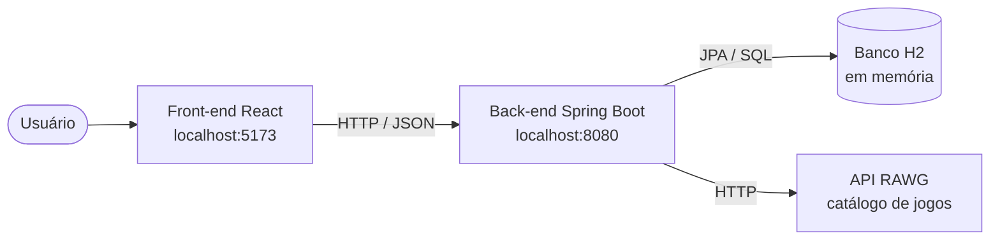
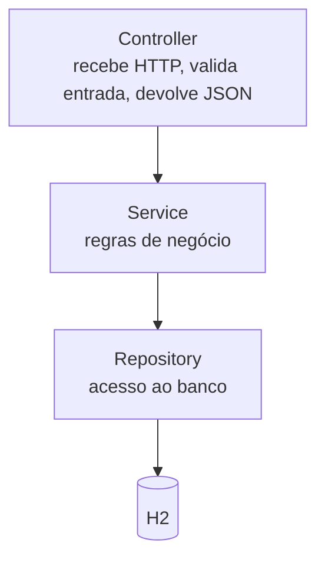
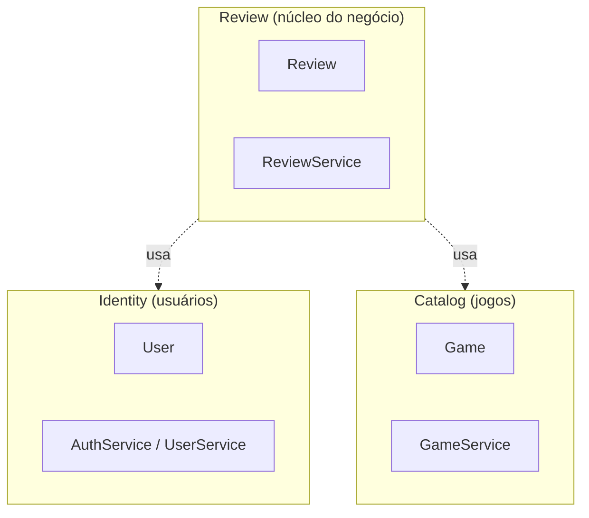
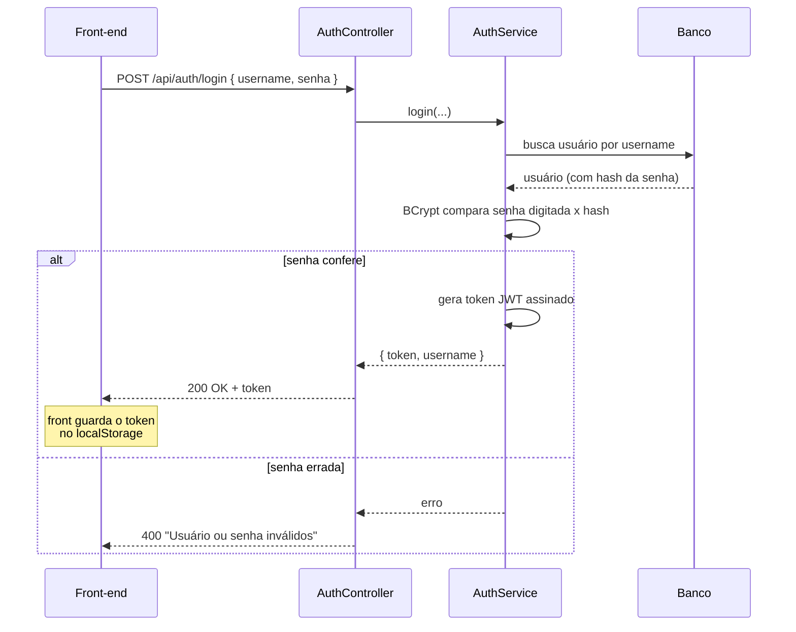
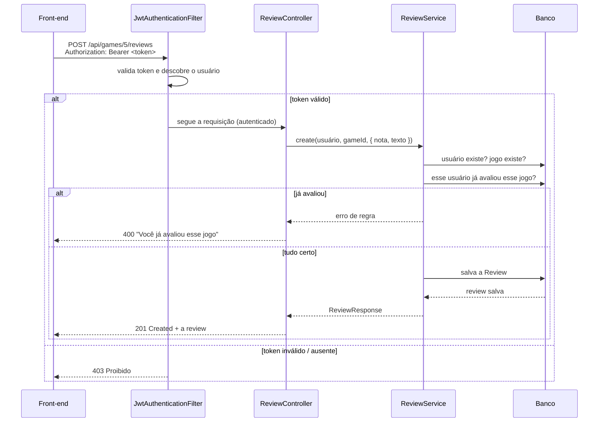
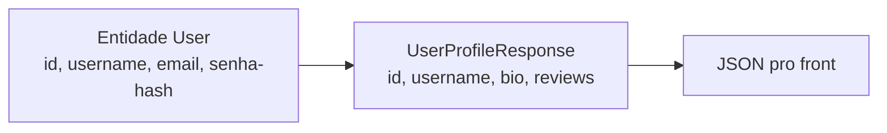
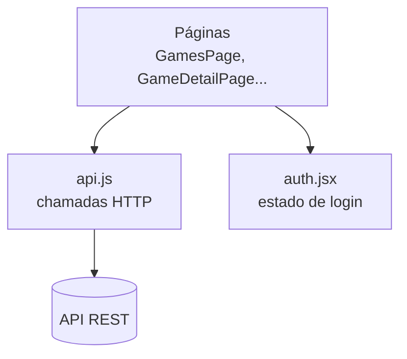
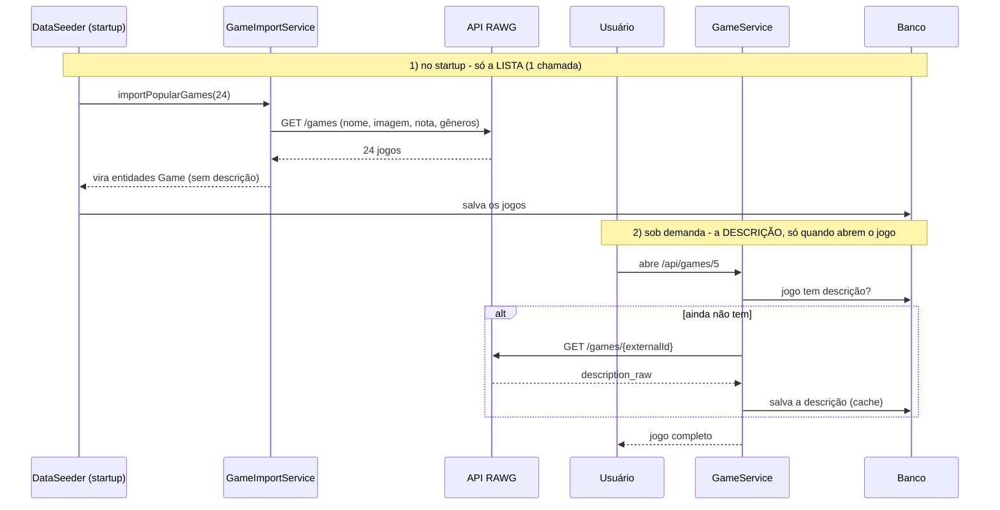

# Arquitetura do GameLog

Este documento explica como a aplicação foi desenhada: o estilo de arquitetura,
como o código está dividido, e como uma requisição percorre o sistema do clique
no navegador até o banco e de volta.

---

## 1. Visão geral

O GameLog é um **monólito**: back-end e front-end são dois projetos, mas o
back-end roda como uma única aplicação (um processo só), com um único banco. Essa
foi uma escolha consciente da Primeira Entrega — começar simples e deixar a base
pronta pra, no futuro, quebrar em microsserviços se precisar.



O front e o back conversam só por **HTTP trocando JSON**. Eles não compartilham
código nem banco — o único contrato entre eles é a API REST. Isso é o que
permitiria, mais tarde, trocar qualquer um dos lados sem mexer no outro.

### Estilo arquitetural: Arquitetura Modular (monólito modular)

O estilo que a gente seguiu é **Arquitetura Modular**: o back-end é um **monólito
modular**, ou seja, um único processo dividido em **módulos por funcionalidade
(subdomínio)**, e dentro de cada módulo o código é organizado em **camadas**.

```
backend/src/main/java/com/gamelog/
├── identity/     ← módulo (usuários, login, perfil)
│   ├── domain/        ← entidades
│   ├── repository/    ← acesso a dados
│   ├── service/       ← regras de negócio
│   ├── controller/    ← endpoints REST
│   └── dto/           ← objetos de transporte
├── catalog/      ← módulo (jogos / RAWG)
├── review/       ← módulo (avaliações — núcleo)
├── collection/   ← módulo (coleção do usuário)
├── security/     ← JWT, filtro, config
├── shared/       ← tratamento de erros comum
└── config/       ← seed de dados
```

> **Não é Clean Architecture.** Foi uma escolha consciente. Clean Architecture
> exigiria inversão de dependência estrita, separação em camadas
> application/domain/infrastructure, *use cases* e *ports/adapters* — o que, pro
> tamanho desta entrega, seria mais cerimônia do que valor (over-engineering).
> A **Arquitetura Modular** entrega o que importa aqui: cada funcionalidade fica
> isolada no seu módulo, com fronteiras claras, fácil de entender e de evoluir —
> e é justamente o que facilita transformar cada módulo num microsserviço lá na
> frente. As camadas (controller/service/repository) cuidam da separação de
> responsabilidades **dentro** de cada módulo.

---

## 2. As camadas dentro de cada módulo

Dentro do back-end, o código é organizado em **camadas**, cada uma com uma
responsabilidade. A regra é: cada camada só conversa com a de baixo. Isso evita
que tudo vire uma bola de espaguete e deixa cada parte testável isoladamente.



| Camada | Responsabilidade | Exemplo no projeto |
|--------|------------------|--------------------|
| **Controller** | Porta de entrada HTTP. Recebe a requisição, valida o formato e devolve a resposta. Não tem regra de negócio. | `AuthController`, `GameController` |
| **Service** | O coração. Aqui ficam as regras: "não pode avaliar o mesmo jogo duas vezes", "username é único", etc. | `AuthService`, `ReviewService` |
| **Repository** | Fala com o banco. A gente só declara o que quer; o Spring Data implementa. | `UserRepository`, `ReviewRepository` |
| **Domain (entidades)** | As "coisas" do sistema (User, Game, Review) mapeadas pra tabelas. | `User`, `Game`, `Review` |

**Por que isso importa:** se amanhã a gente trocar o H2 por PostgreSQL, só mexe
na camada de repositório. Se a regra de avaliação mudar, só mexe no service. O
controller e o front nem ficam sabendo.

---

## 3. Divisão em subdomínios (DDD)

Além das camadas, o código é dividido em **módulos por subdomínio**, seguindo a
ideia de *bounded contexts* do Domain-Driven Design. Cada módulo cuida de um
pedaço do negócio e tem suas próprias camadas dentro.



| Subdomínio | Papel | Por quê |
|-----------|-------|---------|
| **Identity** | Cadastro, login, perfil | Quem é o usuário é um assunto à parte da avaliação |
| **Catalog** | O acervo de jogos | O catálogo existe independente de ter review ou não |
| **Review** | Liga usuário ↔ jogo com nota e texto | É o **núcleo**: o motivo do app existir |
| **Collection** | Jogos que o usuário marcou como seus, com horas jogadas e status | Colecionar é diferente de avaliar: você pode ter o jogo sem ter opinião dele |

A `Review` é o ponto onde os três contextos se encontram — ela referencia um
`User` (autor) e um `Game` (alvo). Por isso o `ReviewService` é o único que
conversa com os três repositórios.

---

## 4. Como a autenticação funciona (JWT)

Não guardamos sessão no servidor. Em vez disso, ao logar, o usuário recebe um
**token JWT** assinado. Em cada requisição protegida, ele manda esse token no
cabeçalho `Authorization`, e o servidor confere a assinatura pra saber quem é.



A senha **nunca** é guardada em texto puro: salvamos só o hash BCrypt. E o token
tem validade (24h) embutida na própria assinatura.

---

## 5. Fluxo completo: publicar uma avaliação

Esse é o caminho mais rico do sistema — passa por autenticação, regra de negócio
e gravação. Mostra todas as camadas trabalhando juntas.



Repare como a responsabilidade é dividida:
- O **filtro de JWT** decide *se* a pessoa pode entrar.
- O **controller** só transporta os dados.
- O **service** aplica as *regras de negócio* (jogo existe, sem review duplicada).
- O **repository** grava.

---

## 6. Por que os DTOs?

Os controllers nunca devolvem a entidade do banco direto. Eles devolvem **DTOs**
(objetos só de transporte), como `ReviewResponse` e `GameResponse`. Dois motivos:

1. **Segurança:** a entidade `User` tem o hash da senha. Se a gente devolvesse o
   `User` direto, esse dado vazaria no JSON. O DTO só carrega o que é público.
2. **Estabilidade:** a forma da tabela no banco pode mudar sem quebrar o front,
   porque o front depende do DTO, não da tabela.



---

## 7. Front-end em resumo

O React é organizado de forma parecida com o back, em responsabilidades:

- **`api.js`** — único lugar que sabe falar HTTP. Toda chamada passa por ele, que
  anexa o token e trata erros. É o "repositório" do front.
- **`auth.jsx`** — guarda o estado de login (quem está logado) e compartilha com
  o app todo via Context, sem precisar passar de componente em componente.
- **`pages/`** — uma tela por arquivo. A raiz `/` é a landing page; o catálogo
  fica em `/games`, e ainda tem jogo, perfil, login e cadastro.
- **`components/`** — pedaços reaproveitáveis (estrelas, barra de navegação,
  card de jogo, spinner, rodapé).



---

## 8. Integração com a API externa (RAWG)

O catálogo não é digitado na mão: ele vem da [RAWG](https://rawg.io), uma API
pública de jogos. Toda a conversa com ela fica isolada numa classe só
(`GameImportService`), então o resto do sistema nem sabe que existe uma API de
fora — pra ele, jogo é só a entidade `Game`.

A importação acontece em dois momentos, de propósito:



Por que dividir assim: baixar a descrição dos 24 jogos no startup deixaria a
aplicação lenta pra subir. Buscando só a lista primeiro e a descrição "quando
precisa" (e guardando depois), o startup fica rápido e a RAWG é chamada só o
necessário. E se a RAWG estiver fora do ar, o `DataSeeder` cai pra uma lista
local de reserva — a aplicação nunca abre sem catálogo.

---

## 9. Princípios de design aplicados

- **Responsabilidade única (S do SOLID):** cada classe faz uma coisa. Controller
  transporta, service decide, repository grava.
- **Inversão de dependência (D do SOLID):** os services dependem de *interfaces*
  de repositório, não de implementações concretas. Quem injeta a implementação é
  o Spring.
- **DRY:** a lógica das estrelas, das chamadas HTTP e do estado de login está cada
  uma num lugar só, reaproveitada por todas as telas.
- **YAGNI:** não construímos o que a entrega não pede (ex: edição/exclusão de
  review, papéis de admin). A base está pronta pra crescer, mas começou enxuta.
