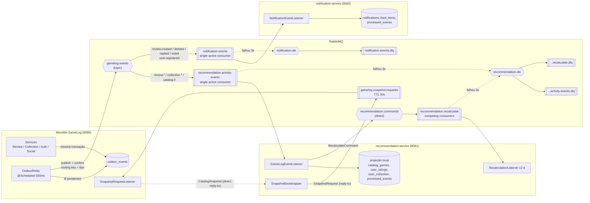
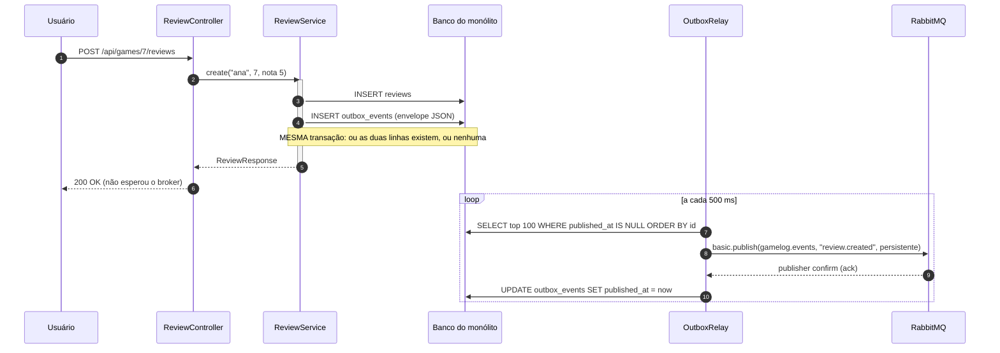
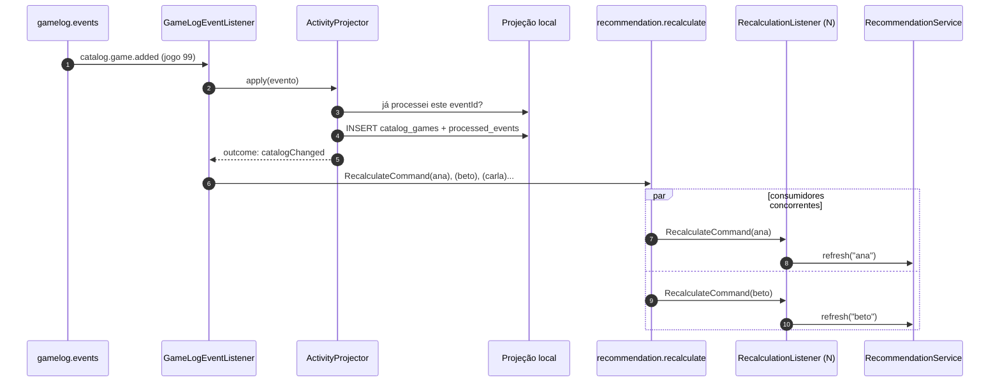
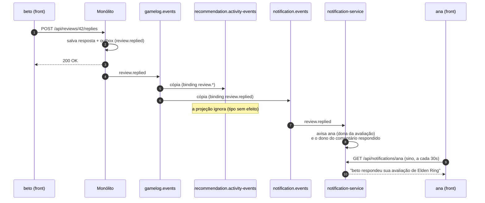
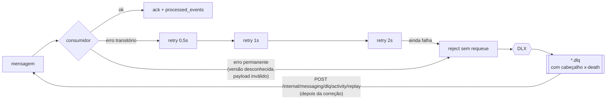

# Arquitetura Orientada a Eventos (TP4)

Documentação da **Quarta Entrega**: a refatoração do GameLog para uma arquitetura
orientada a eventos, com **RabbitMQ** como broker e **Spring AMQP** como abstração.

No TP3 o sistema tinha dois serviços de negócio conversando por HTTP síncrono: o
microsserviço de recomendações chamava o monólito (OpenFeign) toda vez que
precisava recalcular, e um circuit breaker (Resilience4j) segurava a tela quando o
monólito caía. Neste TP essa dependência foi invertida: o monólito **anuncia o que
aconteceu** e quem se interessa guarda o que precisa. Nenhum serviço chama outro
para funcionar.

---

## 1. Resumo do que mudou

| Antes (TP3) | Depois (TP4) |
|---|---|
| Recomendações faziam 2 chamadas HTTP ao monólito por recálculo (atividade + catálogo inteiro) | Recomendações leem uma **projeção local** (tabelas próprias), mantida por eventos |
| Monólito fora do ar = recomendações em modo degradado | Monólito fora do ar = eventos esperam na fila; recomendações continuam em dia com o que já receberam |
| OpenFeign + Resilience4j (timeout, circuit breaker, fallback) | Removidos. O acoplamento temporal sumiu, e com ele o problema que eles resolviam |
| Recálculo só quando o usuário clicava | Recálculo **automático** a cada avaliação/coleção/jogo novo, por comando em fila de trabalho |
| Adicionar um consumidor exigiria um endpoint novo no monólito | **notification-service** novo, criado sem mudar uma linha do produtor |
| Nenhuma garantia entre "salvei a review" e "o outro serviço soube" | **Outbox transacional**: o evento é gravado na mesma transação da review |

Componentes novos:

- `services/gamelog/.../messaging` — publicação por outbox, relay com publisher confirms.
- `services/gamelog/.../integration/snapshot` — responde pedidos de snapshot (request/reply).
- `services/recommendation-service/.../projection` — projeção local, idempotência, ordem.
- `services/recommendation-service/.../messaging` — topologia, consumidores, comando de recálculo, bootstrap.
- `services/notification-service` — serviço novo (porta 8082): notificações e feed da comunidade.
- `frontend/src/features/notifications` — sino de notificações no topo da tela.

---

## 2. Arquitetura orientada a eventos: prós, contras e quando compensa

### 2.1 O que é

Em vez de um serviço **pedir** a outro que faça algo (ou que devolva dados), ele
**publica um fato** que já aconteceu — "a review 42 foi criada" — num broker. Quem
se interessa **assina** aquele tipo de fato e reage no seu ritmo. O produtor não
sabe quem são os consumidores, quantos são, nem se estão no ar.

### 2.2 Vantagens

| Vantagem | Como aparece neste projeto |
|---|---|
| **Desacoplamento temporal** | O monólito publica mesmo com o recommendation-service desligado. Quando ele volta, consome o que acumulou na fila. |
| **Desacoplamento de localização** | Nenhum serviço conhece endereço de outro. Só o nome do exchange. O Eureka deixou de ser necessário para a comunicação entre serviços de negócio (continua servindo ao gateway). |
| **Extensibilidade (open/closed no nível de sistema)** | O notification-service foi criado assinando eventos que já existiam. Zero mudança no monólito. |
| **Escalabilidade independente** | A fila de recálculo tem consumidores concorrentes: mais réplicas = mais vazão, sem coordenação. Um pico de avaliações vira fila, não erro 503. |
| **Resiliência** | Falha de um consumidor não se propaga ao produtor nem aos outros consumidores. Mensagem que falha repetidamente vai para uma DLQ em vez de travar a fila. |
| **Desempenho de leitura** | Abrir a tela de recomendações é uma consulta local. Antes, o recálculo transferia o catálogo inteiro por HTTP. |
| **Auditoria natural** | Cada fato tem `eventId`, tipo, versão e momento. O painel do RabbitMQ e os logs mostram o que aconteceu e em que ordem. |

### 2.3 Desvantagens (e o que foi feito com cada uma)

| Desvantagem | Mitigação adotada |
|---|---|
| **Consistência eventual**: entre salvar a review e o consumidor aplicar o evento passam centenas de ms | Aceitável para recomendação e notificação. O front mostra "sincronizando" quando a projeção ainda não tem dados. Operações que exigem consistência forte (uma review por usuário por jogo, votos) continuam dentro de uma transação no monólito. |
| **Entrega "pelo menos uma vez"**: duplicatas acontecem | Consumidor idempotente: tabela `processed_events` com o `eventId`, gravada na mesma transação que aplica o evento. |
| **Ordem não garantida entre consumidores concorrentes** | Filas de eventos com *single active consumer*; relay publica em ordem e para no primeiro erro; *last-writer-wins* por `occurredAt`; lápides para delete. |
| **Dual write** (gravar no banco e publicar no broker não é atômico) | Outbox transacional (seção 5). |
| **Mais infraestrutura**: um broker para operar, monitorar e manter no ar | RabbitMQ em container (docker-compose/Kubernetes no TP5), filas duráveis, mensagens persistentes, métrica `gamelog.outbox.pending`. |
| **Depuração mais difícil**: o fluxo não é uma pilha de chamadas | `eventId` nos logs de produtor e consumidor, endpoint `/internal/messaging` com estado das filas, DLQ inspecionável; tracing distribuído no TP5. |
| **Evolução de contrato**: consumidores dependem do formato | Envelope com `schemaVersion`; consumidores são *tolerant readers* (ignoram campos desconhecidos); versão maior que a suportada vai para a DLQ em vez de ser aplicada errado. |
| **Bootstrap**: um consumidor novo não viu os eventos passados | Snapshot inicial por request/reply (seção 6.4). |

### 2.4 Quando compensa (e quando não)

Compensa quando:

- **vários interessados** reagem ao mesmo fato (aqui: recomendações e notificações reagem a `review.created`);
- o produtor **não precisa da resposta** para concluir a operação (publicar a review não depende de a recomendação ser recalculada);
- há **picos** que podem ser absorvidos por fila (recalcular para todos os usuários quando entra um jogo novo);
- a disponibilidade de um serviço **não pode depender** da de outro;
- o domínio já pensa em fatos ("avaliou", "zerou", "respondeu").

Não compensa quando:

- quem chama **precisa do resultado agora** para responder ao usuário (login, validar se o jogo existe antes de avaliar) — isso continua síncrono;
- a regra exige **consistência forte** entre agregados (não dá para garantir "uma review por jogo" com eventos);
- o sistema é pequeno, com um único consumidor e sem requisito de disponibilidade — o custo do broker supera o ganho.

No GameLog a divisão ficou assim: **tudo que o usuário faz no monólito continua
síncrono e transacional**; **a propagação desses fatos para os outros serviços é
assíncrona**. O único ponto síncrono entre serviços é o snapshot inicial, e mesmo
ele passa pelo broker.

---

## 3. Topologia



### 3.1 Exchanges, filas e bindings

| Nome | Tipo | Declarado por | Função |
|---|---|---|---|
| `gamelog.events` | topic, durável | monólito e consumidores (idempotente) | Todos os eventos de domínio do monólito. Routing key = tipo do evento. |
| `recommendation.activity-events` | fila durável, SAC, DLX | recommendation-service | Eventos que alimentam a projeção. Bindings: `review.*`, `collection.*`, `catalog.#`. |
| `recommendation.commands` | direct, durável | recommendation-service | Comandos internos do serviço. |
| `recommendation.recalculate` | fila durável, DLX | recommendation-service | Comando `RecalculateCommand`, 2 a 4 consumidores por réplica. |
| `notification.events` | fila durável, SAC, DLX | notification-service | Bindings exatos: `review.created`, `review.deleted`, `review.replied`, `review.voted`, `user.registered`. |
| `gamelog.snapshot.requests` | fila durável, TTL 30s | monólito | Pedidos de snapshot (request/reply). Pedido não atendido em 30s expira. |
| `recommendation.dlx`, `notification.dlx` | direct | cada consumidor | Dead letter exchanges. |
| `*.dlq` | filas duráveis | cada consumidor | Mensagens que esgotaram as tentativas ou são inválidas. |

Cada consumidor **declara a própria fila e os próprios bindings**. O monólito só
declara o exchange. É isso que permite um consumidor novo surgir sem mudar o
produtor: a decisão "o que eu quero ouvir" pertence a quem ouve.

---

## 4. Catálogo de eventos

Todos os eventos usam o mesmo envelope:

```json
{
  "eventId": "8f0c3c1e-6c6a-4f5e-9d0a-2b7f6c1d9e11",
  "eventType": "review.created",
  "schemaVersion": 1,
  "occurredAt": "2026-09-22T23:10:04.512Z",
  "source": "gamelog",
  "aggregateId": "42",
  "payload": {
    "reviewId": 42, "username": "ana", "gameId": 7,
    "gameTitle": "Elden Ring", "genre": "Action, RPG", "rating": 5
  }
}
```

Os mesmos metadados vão também nas propriedades AMQP da mensagem (`message_id`,
`type`, `timestamp`, `app_id`, `delivery_mode=2`), para que o painel do RabbitMQ e
qualquer ferramenta leiam sem abrir o JSON.

| Evento | Publicado quando | Payload | Consumidores |
|---|---|---|---|
| `review.created` | `ReviewService.create` | reviewId, username, gameId, gameTitle, genre, rating | recomendações (nota), notificações (feed) |
| `review.updated` | `ReviewService.update` | idem | recomendações |
| `review.deleted` | `ReviewService.delete` | **último estado** da review | recomendações (lápide), notificações (remove do feed) |
| `review.replied` | `ReviewSocialService.reply` | reviewId, replyId, reviewAuthor, replyAuthor, parentAuthor, gameId, gameTitle, excerpt | notificações |
| `review.voted` | voto novo ou trocado (desfazer não gera evento) | reviewId, reviewAuthor, voter, voteType, gameId, gameTitle | notificações |
| `collection.updated` | `CollectionService.addOrUpdate` | entryId, username, gameId, gameTitle, genre, status, previousStatus, hoursPlayed | recomendações |
| `catalog.game.added` | jogo novo importado (seeder) | gameId, title, genre, coverUrl, releaseYear | recomendações (recálculo para todos) |
| `user.registered` | `AuthService.register` | username | notificações (boas-vindas) |

Decisões de conteúdo:

- **Event-carried state transfer**: o evento leva os dados que o consumidor precisa
  (gênero, título), e não só o id. Senão o consumidor teria que chamar o monólito
  para descobrir — exatamente o acoplamento que se queria remover.
- `review.deleted` leva o **último estado**, porque depois do delete ninguém mais
  consegue ler a review para saber qual nota tirar da média.
- `review.replied` diz **quem está envolvido**, não **quem avisar**. A política de
  notificação (não avisar a si mesmo, não avisar em dobro) é do notification-service.
- Nomes no passado (`created`, `voted`): um evento é um fato consumado, não um pedido.

---

## 5. Publicação confiável: Transactional Outbox

### 5.1 O problema do *dual write*

A forma ingênua seria chamar `rabbitTemplate.convertAndSend(...)` dentro do
`ReviewService.create`. Há duas falhas possíveis e as duas corrompem o sistema:

1. **Publica e a transação falha depois** (constraint, erro de regra): o consumidor
   recebe `review.created` de uma review que não existe.
2. **Commita e a publicação falha** (broker fora, rede): a review existe e
   ninguém fica sabendo — para sempre.

Não há transação distribuída entre H2/Postgres e RabbitMQ.

### 5.2 A solução



- `OutboxEventPublisher.publish` usa `@Transactional(propagation = REQUIRED)`: entra
  na transação do service. O teste `transacaoDesfeitaNaoDeixaEvento` prova que um
  rollback leva o evento junto.
- `OutboxRelay` só marca como publicado depois do **publisher confirm**
  (`spring.rabbitmq.publisher-confirm-type=correlated`). "Enviei" passa a significar
  "o broker gravou".
- Se o broker não confirmar (nack, timeout, conexão recusada), o evento fica
  pendente com `attempts` e `last_error` anotados na própria linha, e é retentado
  no ciclo seguinte.
- O relay **para no primeiro erro**: pular um evento e seguir entregaria
  `review.deleted` antes de `review.created`.
- Eventos publicados há mais de 7 dias são apagados às 4h (`app.outbox.cleanup-cron`).
- Métrica `gamelog.outbox.pending` (Micrometer): parada em zero é o normal; subindo
  sem parar significa broker fora ou relay travado.

Garantia resultante: **pelo menos uma vez, em ordem por produtor**. Se o monólito
cair entre o confirm e o `UPDATE`, o evento sai de novo — daí a idempotência nos
consumidores.

---

## 6. Padrões de mensagem implementados

| Padrão | Onde | Por que este padrão aqui |
|---|---|---|
| **Publish/Subscribe** (topic exchange) | `gamelog.events` → uma fila por serviço | Um fato, vários interessados, cada um com sua cópia e seu ritmo. |
| **Event Notification + Event-Carried State Transfer** | payloads da seção 4 | Consumidor não precisa voltar ao produtor para completar o dado. |
| **Command Message / Point-to-Point** | `RecalculateCommand` em `recommendation.recalculate` | Um trabalho, **um** executor. Diferente de evento: é um pedido, tem destinatário. |
| **Competing Consumers** | 2-4 consumidores por réplica na fila de recálculo | Recálculos são independentes; escalam horizontalmente. |
| **Single Active Consumer** | filas de eventos (`x-single-active-consumer`) | A projeção depende da ordem. Com várias réplicas, uma consome e as outras ficam de reserva. |
| **Request/Reply** (direct reply-to) | snapshot inicial | O consumidor precisa de uma resposta, mas sem saber o endereço do monólito. |
| **Dead Letter Channel** | DLX + DLQ por fila | Mensagem venenosa não trava a fila nem é perdida. |
| **Retry com backoff** | `RetryInterceptorBuilder` (3x, 0,5s → 1s → 2s) | Erro transitório (deadlock, banco ocupado) resolve sozinho. |
| **Idempotent Receiver** | `processed_events` nos dois consumidores | Entrega "pelo menos uma vez" gera duplicatas. |
| **Transactional Outbox** | `outbox_events` + `OutboxRelay` | Atomicidade entre estado e evento. |
| **Guaranteed Delivery** | publisher confirms + filas duráveis + mensagens persistentes | Sobrevive a restart do broker. |
| **Message Expiration** | TTL 30s em `gamelog.snapshot.requests` | Pedido de snapshot velho não tem mais quem espere a resposta. |

### 6.1 Evento → comando: o recálculo



Um evento de catálogo vira N comandos, divididos entre os consumidores de todas as
réplicas. Eventos de usuário (review, coleção) viram um comando só, para o autor,
e só se ele já tem um lote gravado — quem nunca abriu a tela de recomendações é
calculado no primeiro acesso.

### 6.2 Um fato, dois assinantes



### 6.3 Falha e DLQ



- Erros **permanentes** (`AmqpRejectAndDontRequeueException`, `MessageConversionException`)
  não são retentados: três tentativas com a mesma mensagem quebrada dariam o mesmo erro.
- Sem DLQ as únicas opções seriam perder (ack) ou devolver (requeue) — e uma
  mensagem venenosa devolvida volta para a frente da fila e trava todas as outras.
  O teste `mensagemVenenosaVaiPraDlqENaoTravaAFila` prova que a mensagem válida
  atrás dela é processada.
- O replay publica direto na fila original (exchange padrão), sem passar pelo topic:
  não duplica a mensagem para os outros assinantes.

### 6.4 Bootstrap por snapshot (request/reply)

Um consumidor novo (ou com o banco apagado) não viu os eventos passados. Ao subir,
o `SnapshotBootstrapper` do recommendation-service:

1. verifica se já existe o checkpoint `snapshot`; se existe, não faz nada;
2. envia `SnapshotRequest` para `gamelog.snapshot.requests` com `convertSendAndReceive`
   (o Spring AMQP usa o *direct reply-to* do RabbitMQ — sem fila temporária);
3. o monólito responde com `CatalogSnapshot` (jogos, notas, coleção) gerado numa
   transação somente leitura, com `generatedAt` capturado **antes** das leituras;
4. o projetor aplica o snapshot **sem atropelar** linhas que um evento já atualizou
   depois de `generatedAt` (last-writer-wins) e marca como apagadas as notas que
   não estão mais no monólito;
5. grava o checkpoint e pede recálculo para todos os usuários com lote.

Se o monólito não responde em 10s, tenta de novo a cada 15s. Os eventos que
chegam durante esse tempo já vão sendo aplicados — a reconciliação resolve a
sobreposição. `POST /internal/messaging/resync` força um snapshot novo.

---

## 7. Consistência, ordem e idempotência na projeção

| Situação | Como é tratada | Teste |
|---|---|---|
| Mesmo evento entregue duas vezes | `processed_events` (PK = eventId) na mesma transação | `mesmoEventoEntregueDuasVezesAplicaUmaSo`, `reentregaDoMesmoEventoNaoDuplica` |
| Evento antigo chega depois de um mais novo (replay, retry) | cada linha guarda `last_event_at`; evento mais velho é ignorado | `eventoAtrasadoNaoSobrescreveEstadoMaisNovo` |
| `review.deleted` chega antes de `review.created` | delete sem linha cria **lápide** (`deleted=true`) que barra o create atrasado | `deleteAntesDoCreateDeixaLapideQueBarraOCreateAtrasado` |
| Usuário apaga e avalia de novo | evento mais novo reativa a linha | `recriarDepoisDeApagarReativaANota` |
| `schemaVersion` maior que a suportada | rejeitado para a DLQ **sem** marcar como processado | `versaoDeSchemaDesconhecidaVaiPraDlqSemTocarNaProjecao` |
| Evento de tipo que a projeção não usa | marcado como processado e confirmado | `tipoQueNaoInteressaEConfirmadoEIgnorado` |
| Snapshot mais velho que um evento já aplicado | linha mais nova é preservada | `snapshotPreencheAProjecaoMasNaoAtropelaEventoMaisNovo` |

A ordem entre eventos de **um mesmo produtor** é garantida por três camadas: o
relay publica por `id` crescente e para no primeiro erro; o RabbitMQ preserva a
ordem dentro de uma fila; o *single active consumer* impede dois consumidores de
processar a mesma fila em paralelo. O `last_event_at` é a rede de segurança para
os casos em que a ordem ainda assim se quebra (replay da DLQ).

---

## 8. Escalabilidade, resiliência e transações

**Escalabilidade**

- Recálculo: fila de trabalho com consumidores concorrentes. Com 3 réplicas × 4
  consumidores, 12 recálculos em paralelo. O `prefetch=10` evita que um
  consumidor lento acumule mensagens que outro ocioso poderia processar.
- Eventos: *single active consumer* — escala de **disponibilidade**, não de vazão.
  Se a réplica ativa cair, o RabbitMQ promove outra automaticamente.
- Leituras: a tela de recomendações lê da projeção local; o custo não cresce com o
  tamanho do catálogo do monólito.

**Resiliência** (cenários verificados)

| Cenário | Comportamento |
|---|---|
| RabbitMQ fora do ar | O monólito continua aceitando reviews. Eventos acumulam no outbox (`gamelog.outbox.pending` sobe). Quando o broker volta, saem em ordem. |
| recommendation-service fora do ar | Eventos acumulam na fila durável. Ao voltar, o serviço consome o backlog. |
| Monólito fora do ar | Recomendações e notificações continuam servindo leitura normalmente. |
| Mensagem inválida | Vai para a DLQ; a fila segue. |
| Erro transitório no consumidor | 3 tentativas com backoff exponencial. |
| Consumidor novo / banco apagado | Snapshot por request/reply + eventos. |

Os quatro primeiros cenários viraram teste automatizado no TP5:
[`scripts/resilience-test.sh`](../scripts/resilience-test.sh) derruba de verdade
cada container da stack do Docker Compose e confere o comportamento pela API
(o de "serviço consumidor fora" é exercitado com o notification-service). Roda
no job `e2e` do CI a cada push — ver [`IMPLANTACAO.md`](IMPLANTACAO.md).

**Transações**

- Dentro do monólito: transação local (JPA) cobre estado + outbox.
- Entre serviços: não há transação distribuída (2PC). A consistência é **eventual**,
  e cada consumidor aplica evento + `processed_events` numa transação local.
  É o modelo de **saga coreografada** sem passos de compensação, porque nenhum
  consumidor pode "recusar" um fato do monólito — uma recomendação não invalida uma review.
- Regras que exigem consistência forte (uma review por usuário por jogo, não votar
  na própria review) **ficaram no monólito**, dentro da transação.

---

## 9. Spring AMQP: as abstrações usadas

| Abstração | Onde | Para quê |
|---|---|---|
| `RabbitTemplate.send(..., CorrelationData)` | `OutboxRelay` | Publicação com publisher confirm correlacionado |
| `RabbitTemplate.convertSendAndReceiveAsType` | `SnapshotBootstrapper` | Request/reply com tipo genérico |
| `RabbitTemplate.convertAndSend` | `RecalculationRequester` | Envio de comando |
| `@RabbitListener` (retorno = resposta) | `SnapshotRequestListener` | O valor de retorno vai para o `replyTo` |
| `@RabbitListener(concurrency = "2-4")` | `RecalculationListener` | Consumidores concorrentes |
| `QueueBuilder` / `ExchangeBuilder` / `Declarables` | `*MessagingConfig` | Topologia declarada em código (RabbitAdmin aplica na subida) |
| `Jackson2JsonMessageConverter` | todos | JSON com o `ObjectMapper` do Spring Boot; tipo inferido do parâmetro do listener, sem acoplar a classes do produtor |
| `SimpleRabbitListenerContainerFactory` + `RetryInterceptorBuilder` + `RejectAndDontRequeueRecoverer` | consumidores | Retry com backoff e DLQ |
| `AmqpRejectAndDontRequeueException` | projetores | Marca erro permanente |
| `AmqpAdmin.getQueueInfo` | `OperationsController` | Profundidade das filas no endpoint interno |

Cada serviço tem **sua própria cópia dos records de mensagem** (`GameLogEvent`,
`EventPayloads`). Os serviços compartilham o **contrato JSON**, não uma
biblioteca — assim cada um evolui no seu ritmo e lê só os campos que usa.

---

## 10. Endpoints novos

### notification-service (via gateway, `/api/notifications/**`)

| Método | Rota | Token? | O que faz |
|---|---|---|---|
| GET | `/api/notifications/feed?limit=20` | não | Últimas avaliações publicadas na comunidade |
| GET | `/api/notifications/{username}?limit=20` | **sim** | Caixa de entrada + contagem de não lidas |
| POST | `/api/notifications/{username}/{id}/read` | **sim** | Marca uma como lida (404 se for de outra pessoa) |
| POST | `/api/notifications/{username}/read-all` | **sim** | Marca todas como lidas |

### Operação (direto no serviço, fora do gateway)

| Método | Rota | O que faz |
|---|---|---|
| GET | `:8081/internal/messaging` | Estado da projeção (checkpoint, contagens) e profundidade/consumidores das filas |
| POST | `:8081/internal/messaging/resync` | Descarta o checkpoint e pede snapshot novo |
| POST | `:8081/internal/messaging/dlq/{activity\|recalculate}/replay?max=100` | Devolve mensagens da DLQ para a fila original |

O endpoint `GET /api/users/{username}/game-activity` do monólito, criado no TP3
para o Feign, deixou de ser usado pelo microsserviço. Foi mantido por
compatibilidade (e pelo teste que o cobre), mas nenhum serviço depende dele.

---

## 11. Testes

| Classe | Tipo | O que prova |
|---|---|---|
| `OutboxEventPublisherTest` | slice JPA | Envelope gravado; rollback leva o evento junto; commit deixa pendente |
| `OutboxRelayTest` | unitário (Mockito) | Só marca publicado com ack; nack/timeout/conexão recusada deixam pendente; para no primeiro erro |
| `GameLogMessagingIntegrationTest` | integração, **RabbitMQ em container** | Operação → outbox → broker com routing key e envelope corretos; ordem create/update/delete; snapshot por request/reply |
| `ReviewSocialServiceTest` (+4) | slice JPA | `review.voted`/`review.replied` com os envolvidos certos; desfazer voto e operação recusada não publicam |
| `ActivityProjectorTest` | slice JPA | Duplicata, ordem, lápide, versão, snapshot, retrato da projeção |
| `RecommendationMessagingIntegrationTest` | integração, RabbitMQ em container | Eventos → projeção → recomendação; jogo novo → comando → recálculo automático; DLQ não trava a fila; reentrega não duplica |
| `NotificationProjectorTest` | slice JPA | Regras de quem avisar; idempotência; feed |
| `NotificationControllerTest` | contrato HTTP | Caixa de entrada, marcar lida, isolamento entre usuários, feed |
| `NotificationMessagingIntegrationTest` | integração, RabbitMQ em container | **Fan-out** (a mesma publicação chega a dois assinantes); DLQ |
| `AuthenticationFilterTest` (+2), `GatewayRoutingTest` (+1) | gateway | Rota e proteção de `/api/notifications/**` |
| `notification-text.test.js` | front | Link, tempo relativo, contador do sino |

Os testes de integração usam **Testcontainers** (`rabbitmq:3.13-management-alpine`
com `@ServiceConnection`): um broker real por classe de teste, sem mock de AMQP.
Exigem Docker na máquina/CI.

```bash
mvn test            # todos os módulos Java
cd frontend && npm test
```

---

## 12. Como rodar (local, sem Docker Compose)

```bash
docker run -d --name rabbitmq -p 5672:5672 -p 15672:15672 rabbitmq:3.13-management-alpine

cd platform/config-server            && mvn spring-boot:run   # 8888
cd platform/discovery-server         && mvn spring-boot:run   # 8761
cd services/gamelog                  && mvn spring-boot:run   # 8080
cd services/recommendation-service   && mvn spring-boot:run   # 8081
cd services/notification-service     && mvn spring-boot:run   # 8082
cd platform/api-gateway              && mvn spring-boot:run   # 8090
cd frontend && npm install && npm run dev                     # 5173
```

Painel do RabbitMQ: `http://localhost:15672` (guest/guest) — em *Exchanges →
gamelog.events → Bindings* aparecem as filas dos dois assinantes; em *Queues* dá
para ver as mensagens passando e as DLQs.

A partir do TP5 o jeito recomendado é `docker compose up` (ver
[`IMPLANTACAO.md`](IMPLANTACAO.md)).

### Roteiro para verificar o comportamento

1. Logue como `demo`, abra **Recomendados**.
2. Avalie um jogo de um gênero novo. Sem clicar em "Recalcular", recarregue
   Recomendados após ~1s: a lista mudou (evento → comando → recálculo).
3. Com outro usuário, responda a avaliação do `demo`. O sino do `demo` mostra o aviso.
4. Pare o recommendation-service, faça duas avaliações, suba de novo: as duas são
   aplicadas (fila durável).
5. Pare o RabbitMQ, faça uma avaliação (funciona), veja `outbox_events` com
   `published_at` nulo no console H2; suba o RabbitMQ: o evento sai.
6. `GET http://localhost:8081/internal/messaging` mostra filas e projeção.
