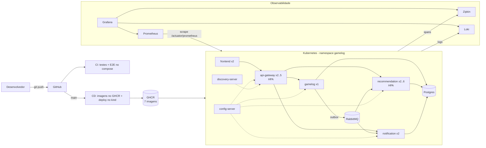
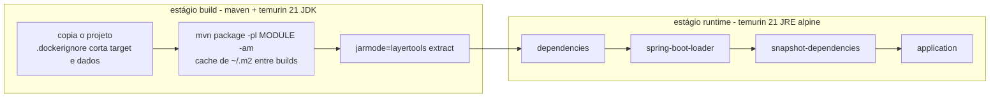
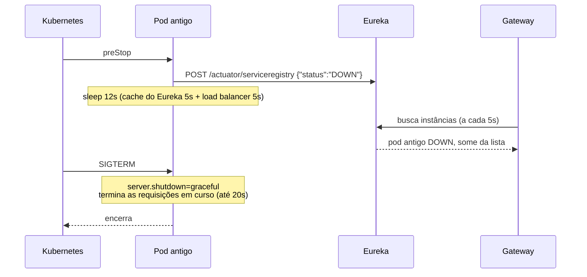
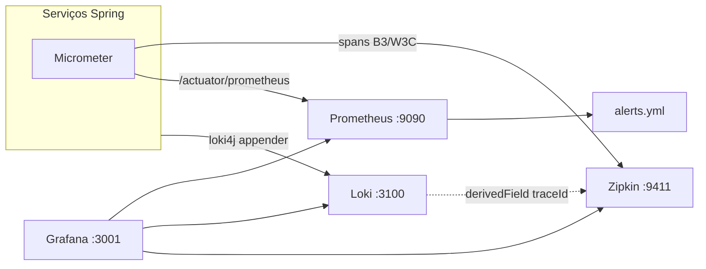
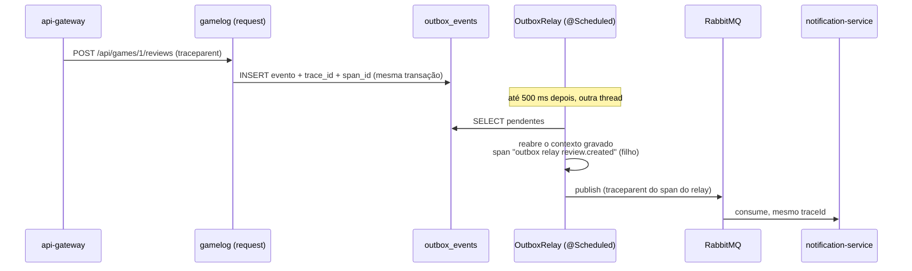
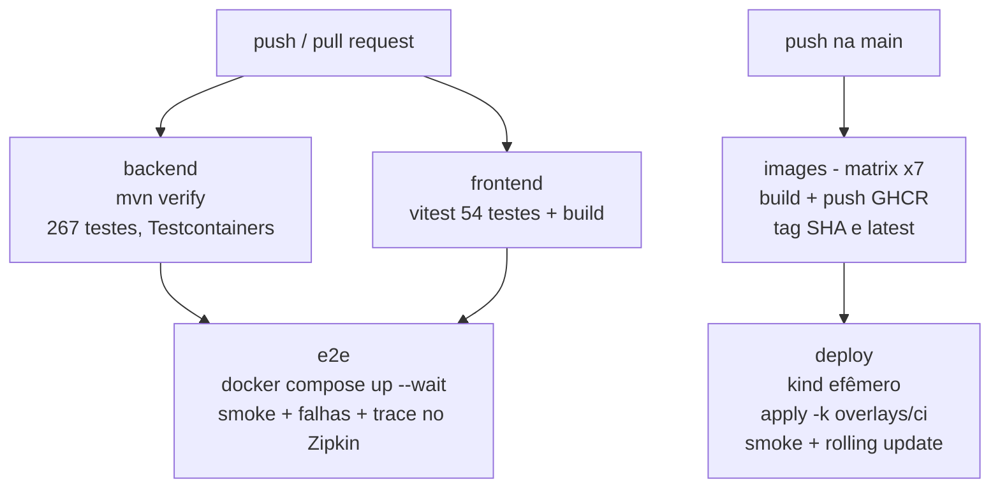

# Implantação e Manutenção em Produção (TP5)

Este documento descreve como o GameLog sai do "roda na minha máquina com seis
terminais" para um sistema empacotado em containers, orquestrado no Kubernetes,
observável (logs, métricas e traces) e entregue por um pipeline de CI/CD no
GitHub Actions.

| Tema | Onde está |
|---|---|
| Imagens Docker | [`Dockerfile`](../Dockerfile), [`frontend/Dockerfile`](../frontend/Dockerfile) |
| Ambiente completo local | [`docker-compose.yml`](../docker-compose.yml) |
| Kubernetes | [`k8s/`](../k8s) (kustomize: `base` + overlays `local` e `ci`) |
| Observabilidade | [`platform/observability`](../platform/observability), [`ops/`](../ops) |
| Testes de sistema | [`scripts/`](../scripts) |
| CI/CD | [`.github/workflows/ci.yml`](../.github/workflows/ci.yml), [`.github/workflows/cd.yml`](../.github/workflows/cd.yml) |
| Histórico de mudanças | [`CHANGELOG.md`](../CHANGELOG.md) |

---

## 1. Visão geral



O que mudou em relação ao TP4:

| Antes (TP4) | Agora (TP5) |
|---|---|
| H2 em arquivo, um por serviço | **PostgreSQL** (um banco por serviço no mesmo servidor); H2 continua sendo o padrão para rodar sem Docker |
| `mvn spring-boot:run` em 6 terminais | `docker compose up` ou `kubectl apply -k` |
| Endereços fixos (`localhost:8761`...) | Tudo por variável de ambiente, com o valor local como padrão |
| Log só no console | Logs centralizados no **Loki**, com `traceId` em cada linha |
| Sem métricas | **Prometheus** + alertas + dashboard no **Grafana** |
| Sem tracing | **Micrometer Tracing + Zipkin**, atravessando HTTP **e** RabbitMQ (inclusive o outbox) |
| Testes só de unidade/integração | + smoke test, testes de falha e de rolling update contra o sistema no ar |
| Nenhuma automação | **CI** a cada push e **CD** a cada merge na `main` |

---

## 2. Containers (Docker)

### 2.1 Uma imagem por serviço, um Dockerfile para todos

Os seis serviços Java usam o **mesmo** [`Dockerfile`](../Dockerfile), parametrizado
por `--build-arg MODULE=services/gamelog` (ou outro módulo):



Decisões:

- **Multi-stage**: o JDK e o Maven ficam no estágio de build; a imagem final
  tem só o JRE (alpine), o que reduz tamanho e superfície de ataque.
- **Jar em camadas**: dependências mudam pouco e ficam em camadas de baixo;
  uma mudança de código reconstrói e envia só a camada `application`
  (alguns KB em vez de ~80 MB).
- **Cache de dependências**: `RUN --mount=type=cache,target=/root/.m2` mantém o
  repositório Maven entre builds; só o primeiro build baixa as dependências.
- **`-am` (also-make)**: o módulo é construído junto com os módulos de que
  depende (por exemplo `platform/observability`), sem publicar nada num repositório.
- **Usuário sem privilégio** (UID numérico 10001): o Kubernetes só consegue
  validar `runAsNonRoot: true` com UID numérico.
- **JVM ciente do container**: `-XX:MaxRAMPercentage=75` dimensiona o heap a
  partir do limite de memória do pod, e não da memória do nó;
  `-XX:+ExitOnOutOfMemoryError` faz o processo morrer (e o orquestrador
  reiniciar) em vez de seguir meio vivo.

O front-end tem imagem própria ([`frontend/Dockerfile`](../frontend/Dockerfile)):
build com Node 20 e servido pelo `nginx-unprivileged` na porta 8080. O
[`nginx.conf.template`](../frontend/nginx.conf.template) faz *fallback* de SPA
(`try_files ... /index.html`), repassa `/api` para `${API_GATEWAY_URL}` (o
front chama a própria origem, sem CORS) e expõe `/healthz` para o healthcheck.

### 2.2 docker compose: o sistema inteiro com um comando

```bash
docker compose up -d --build --wait     # 13 containers, espera todos ficarem saudáveis
./scripts/smoke-test.sh                 # confere o fluxo de ponta a ponta
```

| Container | Imagem | Porta no host |
|---|---|---|
| frontend | `gamelog/frontend` | **3000** |
| api-gateway | `gamelog/api-gateway` | **8090** |
| discovery-server | `gamelog/discovery-server` | 8761 |
| config-server, gamelog, recommendation-service, notification-service | `gamelog/*` | (só na rede interna) |
| postgres | `postgres:16-alpine` | (só na rede interna) |
| rabbitmq | `rabbitmq:3.13-management-alpine` | 5672, 15672 (painel) |
| zipkin | `openzipkin/zipkin:3` | 9411 |
| loki | `grafana/loki:3.1.1` | 3100 |
| prometheus | `prom/prometheus:v2.54.1` | 9090 |
| grafana | `grafana/grafana:11.2.0` | 3001 (admin/admin) |

Toda porta do host é uma variável com padrão (`EUREKA_HOST_PORT`,
`GATEWAY_HOST_PORT`, `FRONTEND_HOST_PORT`...), para conviver com outros projetos
na mesma máquina, por exemplo `EUREKA_HOST_PORT=18761 docker compose up -d`.

Ordem de subida: cada serviço declara `depends_on: condition: service_healthy`,
e o healthcheck de cada serviço Java é o **readiness** do Actuator
(`/actuator/health/readiness`). A cadeia fica assim: Postgres e RabbitMQ →
config-server → discovery-server → serviços de negócio → gateway → front.

O Postgres cria os três bancos (`gamelog`, `recommendations`,
`notifications`) no primeiro start, por
[`ops/postgres/init-databases.sql`](../ops/postgres/init-databases.sql). Cada
serviço continua dono do próprio banco; nenhum lê tabela de outro.

### 2.3 Configuração por ambiente

Nenhum endereço fica fixo no código. O `config-repo` (servido pelo Config
Server) e os `application.yml` usam placeholders com o valor de desenvolvimento
como padrão:

| Variável | Padrão (sem Docker) | Compose / Kubernetes |
|---|---|---|
| `CONFIG_SERVER_URL` | `http://localhost:8888` | `http://config-server:8888` |
| `EUREKA_URL` | `http://localhost:8761/eureka/` | `http://discovery-server:8761/eureka/` |
| `DB_URL` / `DB_USERNAME` / `DB_PASSWORD` | H2 em arquivo | `jdbc:postgresql://postgres:5432/<banco>` |
| `RABBITMQ_HOST` / `_PORT` / `_USERNAME` / `_PASSWORD` | `localhost` / `5672` / `guest` | `rabbitmq` + credencial do Secret |
| `ZIPKIN_URL` | `http://localhost:9411/api/v2/spans` | `http://zipkin:9411/api/v2/spans` |
| `LOKI_URL` (perfil `loki`) | — | `http://loki:3100/loki/api/v1/push` |
| `TRACING_SAMPLING_PROBABILITY` | `1.0` | `1.0` (em produção real, algo como `0.1`) |
| `CORS_ALLOWED_ORIGINS` | `http://localhost:5173` | origem do front |
| `JWT_SECRET` | valor de desenvolvimento | Secret |

O driver JDBC é inferido pela URL, então o mesmo artefato roda com H2 ou com
Postgres, sem perfil a mais.

---

## 3. Kubernetes

### 3.1 Organização (kustomize)

```
k8s/
├── base/                       → o que é igual em todo ambiente
│   ├── kustomization.yaml      → namespace, ConfigMap gamelog-env, Secret, patches
│   ├── data/                   → postgres e rabbitmq (StatefulSet + PVC)
│   ├── observability/          → zipkin, loki, prometheus (+RBAC), grafana
│   ├── platform/               → config-server, discovery-server, api-gateway
│   ├── services/               → gamelog, recommendation, notification, frontend
│   └── autoscaling.yaml        → HPAs
└── overlays/
    ├── local/                  → NodePorts para acessar do host (Docker Desktop, kind, minikube)
    └── ci/                     → réplica única + imagens do GHCR com a tag do commit
```

Os arquivos de configuração **não são copiados** para dentro dos manifestos:
`config-repo/kustomization.yaml` e `ops/kustomization.yaml` geram ConfigMaps a
partir dos mesmos `.yml` que o docker compose usa. O `config-server` monta o
ConfigMap `config-repo` em `/app/config-repo` e o serve com o perfil `native`.
Como o kustomize acrescenta um hash ao nome do ConfigMap, mudar um `.yml` muda o
nome e o Deployment faz rollout sozinho.

### 3.2 Réplicas e o porquê de cada número

| Workload | Tipo | Réplicas | Motivo |
|---|---|---|---|
| api-gateway | Deployment | 2 (HPA 2–5) | Sem estado; é a porta de entrada |
| recommendation-service | Deployment | 2 (HPA 2–6) | Sem estado; o recálculo é uma fila de trabalho (consumidores concorrentes) |
| notification-service | Deployment | 2 | Sem estado; a fila de eventos usa *single active consumer*, então a segunda réplica é de **disponibilidade** |
| frontend | Deployment | 2 | nginx estático |
| gamelog | Deployment, `Recreate` | **1** | Uploads num volume RWO e relay do outbox que depende de ordem (ver limitações) |
| config-server, discovery-server | Deployment | 1 | Os serviços sobem sem eles (`optional:` e cache local do Eureka) |
| postgres, rabbitmq | StatefulSet + PVC | 1 | Dados persistentes |

### 3.3 Escala automática (HPA)

```yaml
# k8s/base/autoscaling.yaml (resumo)
api-gateway:            min 2, max 5, CPU média 70% do request
recommendation-service: min 2, max 6, CPU média 70% do request
```

O HPA lê CPU do **metrics-server** (o script `k8s-deploy-local.sh` o instala).
A escala é **segura para as filas**: uma réplica nova de recomendações entra
como mais um consumidor concorrente de `recommendation.recalculate` e como
reserva na fila de eventos (single active consumer). Nenhuma reconfiguração no
broker é necessária.

Para ver a escala na prática:

```bash
kubectl -n gamelog get hpa -w
# em outro terminal, gerar carga no gateway:
kubectl -n gamelog run carga --rm -it --image=busybox -- \
  sh -c 'while true; do wget -q -O- http://api-gateway:8090/api/games >/dev/null; done'
```

### 3.4 Sondas (probes) e ciclo de vida

Cada serviço Java tem três sondas, todas no Actuator:

| Sonda | Endpoint | Para quê |
|---|---|---|
| `startupProbe` | `/actuator/health/liveness` | Dá até 3 min para a JVM subir antes de começar a avaliar vida (evita reinício em loop no start lento) |
| `readinessProbe` | `/actuator/health/readiness` | Só recebe tráfego do Service quando o contexto Spring está pronto |
| `livenessProbe` | `/actuator/health/liveness` | Reinicia o pod se a aplicação travar |

O readiness **não** inclui o RabbitMQ de propósito: com o broker fora, o
monólito continua aceitando escrita (o evento espera no outbox). Tirar o pod do
balanceamento por causa do broker derrubaria justamente a resiliência que o
TP4 construiu.

**Rolling update sem erro.** A primeira medição de rollout teve 2 leituras com
erro em 8: o Spring parava o servidor web **antes** de o gateway saber que o
pod tinha saído (o gateway descobre as instâncias pelo Eureka, com cache). A
correção foi feita em três partes:



1. `preStop` marca a instância como DOWN no Eureka e espera os caches expirarem.
2. `server.shutdown: graceful` termina as requisições que já estavam em curso.
3. O gateway tem um filtro **Retry** para `GET` (2 tentativas em 502/503,
   `IOException` ou timeout): se mesmo assim uma leitura cair num pod saindo,
   ela é refeita em outra réplica. Escrita não é repetida, porque não é idempotente.

Resultado: `scripts/k8s-rollout-test.sh` reinicia os serviços de
recomendação e notificação com tráfego contínuo e mediu **0 erros em 15
iterações**, sem perder nenhum evento.

`maxUnavailable: 0, maxSurge: 1`: o pod novo só entra quando está *ready*, e
só então um antigo sai.

### 3.5 Detalhes que custaram uma depuração

- **`enableServiceLinks: false`** em todo pod. O Kubernetes injeta variáveis
  legadas por Service (`RABBITMQ_PORT=tcp://10.96.x.x:5672`), com o mesmo nome
  do placeholder `${RABBITMQ_PORT}`, e os serviços morriam no startup com
  `NumberFormatException`. A descoberta aqui é por DNS; as variáveis são desnecessárias.
- **Sonda do RabbitMQ por TCP.** A sonda `exec rabbitmq-diagnostics` sobe uma VM
  Erlang a cada execução e consumia ~1 CPU inteira. Com `tcpSocket` na 5672, o
  consumo caiu para o de repouso.
- **UID numérico** na imagem (ver 2.1).

### 3.6 Segredos

Os Secrets do `base` (`gamelog-secrets`: senha do banco, do RabbitMQ, chave do
JWT, senha do Grafana) estão versionados **com valores de desenvolvimento**,
para que `kubectl apply -k` funcione sem passo manual numa entrega acadêmica.
Os pods só os leem via `secretKeyRef`, então trocar a origem não muda nenhum
Deployment. Em um ambiente real, o `secretGenerator` sai do repositório e o
Secret vem de:

- **External Secrets Operator** lendo do cofre da nuvem (AWS Secrets Manager,
  Azure Key Vault, GCP Secret Manager), ou
- **Sealed Secrets** (o Git guarda só a versão cifrada), ou
- `kubectl create secret` no pipeline, a partir de *secrets* do GitHub com um
  *environment* protegido.

### 3.7 Como rodar no cluster local

Funciona no Kubernetes do Docker Desktop (modo kind), no kind e no minikube:

```bash
./scripts/k8s-deploy-local.sh     # build, carrega as imagens no nó, metrics-server, apply, espera
kubectl -n gamelog get pods,hpa
```

| Acesso (overlay local) | Endereço |
|---|---|
| Front-end | http://localhost:30000 |
| API Gateway | http://localhost:30080 |
| Grafana | http://localhost:30001 |
| Zipkin | http://localhost:30411 |

Se os NodePorts não estiverem mapeados no host (Docker Desktop), use
`kubectl -n gamelog port-forward svc/api-gateway 18090:8090` e rode os testes
com `BASE_URL=http://localhost:18090`.

```bash
BASE_URL=http://localhost:30080 ./scripts/smoke-test.sh
BASE_URL=http://localhost:30080 ./scripts/k8s-rollout-test.sh
kubectl delete namespace gamelog     # remove tudo
```

---

## 4. Monitoramento e observabilidade

Os três sinais (logs, métricas e traces) são ligados pelo `traceId`: da linha de
log se abre o trace, e do trace se abrem os logs daquela requisição.



### 4.1 Tracing distribuído (Micrometer Tracing + Brave + Zipkin)

Todo serviço (menos config e discovery, que só geram ruído) exporta spans para
o Zipkin. A propagação cobre:

- **HTTP**: front → gateway → serviço (cabeçalho `traceparent`).
- **RabbitMQ**: `spring.rabbitmq.template.observation-enabled` e
  `listener.simple.observation-enabled` colocam o contexto no cabeçalho da
  mensagem e o reabrem no consumidor.
- **Outbox**: aqui está a parte que não vem pronta. O evento não é publicado na
  requisição; ele é gravado na tabela e publicado **depois** por um job
  agendado, em outra thread e sem contexto. Sem tratamento, o trace
  terminaria no `INSERT` e a publicação começaria um trace novo, sem pai.



O `OutboxEventPublisher` grava `trace_id`/`span_id` do span corrente junto com o
evento; o `OutboxRelay` reconstrói esse contexto como pai de um span
`outbox relay <tipo>` (kind PRODUCER) e publica *dentro* dele. No Zipkin, uma
avaliação aparece como **um único trace** do gateway até os dois consumidores
e o comando de recálculo. Isso é coberto por `OutboxTracingTest` e verificado no
CI (passo "Trace ponta a ponta no Zipkin").

**Ruído removido** pelo módulo compartilhado
[`platform/observability`](../platform/observability) (auto-configuração, um
`ObservationPredicate` por caso): requisições `/actuator/**` (sondas e scrape a
cada poucos segundos) e chamadas do cliente Eureka. No `config-repo`,
`management.observations.enable.tasks.scheduled=false` desliga os spans dos
jobs `@Scheduled` (o relay roda a cada 500 ms, na maioria das vezes sem
trabalho). Sem esses filtros, quase todos os traces seriam sondas.

### 4.2 Logs centralizados (Loki)

Com o perfil `loki` ativo (no compose e no Kubernetes), o
`logback-spring.xml` de cada serviço adiciona o appender **loki4j**, que envia em
lote para o Loki com os rótulos `app`, `host` e `level`:

```
INFO  [http-nio-8080-exec-3] c.g.review.service.ReviewService traceId=66f0c2... spanId=9a1b... - review 42 criada
```

No Grafana (Explore → Loki):

```logql
{app="gamelog", level="ERROR"}
{app=~".+"} |= "traceId=66f0c2"          # todos os serviços de uma requisição
```

O datasource do Loki tem um *derived field* que transforma o `traceId` da linha
num link para o trace no Zipkin. Sem o perfil `loki` (rodando local, sem
Docker), o log continua só no console, e o `traceId` também aparece nele.

### 4.3 Métricas (Prometheus) e alertas

Cada serviço expõe `/actuator/prometheus` com as métricas da JVM, HTTP
(histograma de latência), pool de conexões e RabbitMQ, todas com o rótulo
`application`. Métrica de negócio própria: **`gamelog_outbox_pending`**, o
número de eventos gravados e ainda não publicados.

Descoberta dos alvos:
- **compose**: `dns_sd_configs` (cada nome de serviço resolve para seus containers);
- **Kubernetes**: `kubernetes_sd_configs` por pod, filtrando a anotação
  `prometheus.io/scrape: "true"`. Réplica nova criada pelo HPA entra no scrape
  sozinha (verificado: 9 pods descobertos sem configuração manual);
- **RabbitMQ**: plugin `rabbitmq_prometheus`, em `/metrics/per-object` (profundidade por fila).

Alertas ([`ops/prometheus/alerts.yml`](../ops/prometheus/alerts.yml)), visíveis
em http://localhost:9090/alerts:

| Alerta | Condição | Significa |
|---|---|---|
| `ServicoFora` | `up == 0` por 1 min | instância não responde |
| `OutboxAcumulando` | `gamelog_outbox_pending > 100` por 2 min | broker fora ou relay travado: eventos não saem |
| `MensagensNaDLQ` | alguma fila `*.dlq` com mensagem | mensagem falhou 3 vezes e precisa de análise (replay por `/internal/messaging/dlq/...`) |
| `TaxaDeErro5xx` | > 5% de 5xx em 5 min | regressão ou dependência fora |

Sem Alertmanager, os alertas ficam visíveis no Prometheus. Em produção, bastaria
apontar `alerting:` para um Alertmanager com o canal da equipe.

### 4.4 Dashboard (Grafana)

Provisionado por arquivo (datasources e dashboard sobem prontos, sem clique):
**GameLog – visão geral**, com filtro por aplicação:

- instâncias no ar, eventos presos no outbox, mensagens nas DLQs, taxa de 5xx;
- requisições por segundo e latência p95 por serviço;
- mensagens por fila e consumo por segundo (RabbitMQ);
- heap da JVM por instância;
- logs WARN/ERROR ao vivo, com o `traceId` clicável.

### 4.5 Manutenção: roteiros comuns

| Situação | O que olhar / fazer |
|---|---|
| Usuário diz que a avaliação "não apareceu" no feed | Dashboard: outbox pendente? DLQ? Pelo `traceId` no Loki, abrir o trace e ver onde parou |
| `OutboxAcumulando` disparou | `kubectl -n gamelog get pods` (RabbitMQ no ar?); log do gamelog `OutboxRelay`; quando o broker volta, o backlog sai sozinho em ordem |
| `MensagensNaDLQ` disparou | Log do consumidor com o motivo; corrigir e `POST /internal/messaging/dlq/{fila}/replay` |
| Lentidão | Painel de latência p95 → trace mais lento no Zipkin → span culpado |
| Atualizar um serviço | merge na `main` → CD publica a imagem → `kubectl set image` ou `apply -k` com a nova tag; rolling update sem erro (3.4) |
| Voltar versão | `kubectl -n gamelog rollout undo deployment/<servico>` (as imagens por SHA são imutáveis) |
| Mudar configuração | editar `config-repo/*.yml` → `apply -k` gera um ConfigMap novo → rollout do config-server; os serviços releem com `POST /actuator/refresh` (como no TP3) ou num rollout |

---

## 5. CI/CD (GitHub Actions)



### 5.1 CI ([`ci.yml`](../.github/workflows/ci.yml)): todo push em `main`/`tp*` e todo PR

| Job | O que faz |
|---|---|
| **backend** | `mvn -B verify` em todos os módulos: unidade, slices JPA, contrato HTTP e integração com **RabbitMQ real** (Testcontainers). Publica os relatórios do Surefire como artefato e um resumo por módulo na página da execução |
| **frontend** | `npm ci`, `npm test` (Vitest) e `npm run build` |
| **e2e** | Só roda se os dois passarem. Constrói as imagens, sobe os 13 containers com `docker compose up --wait` e roda `smoke-test.sh`, `resilience-test.sh` e uma checagem de que existe no Zipkin um trace que vai do gateway ao consumidor passando pelo outbox. Em falha, anexa os logs de todos os containers |

`concurrency` cancela a execução anterior da mesma branch quando chega um push novo.

### 5.2 CD ([`cd.yml`](../.github/workflows/cd.yml)): todo push na `main`

| Job | O que faz |
|---|---|
| **images** | Matriz de 7 imagens em paralelo. `docker/build-push-action` publica em `ghcr.io/evertonrocha2/gamelog-<serviço>` com a tag **do commit** (imutável, usada no deploy e no rollback) e `latest`. Cache de camadas no cache do Actions, por imagem |
| **deploy** | Cria um cluster **kind** no runner, cria o `imagePullSecret` do GHCR, troca `newTag: latest` pelo SHA no overlay `ci` e aplica. Espera todos os rollouts e roda `smoke-test.sh` e `k8s-rollout-test.sh` contra o cluster, pelo NodePort. O resumo lista as imagens que de fato rodaram |

O kind é o **ambiente de homologação** do pipeline: prova que as imagens
recém-publicadas sobem juntas a partir dos manifestos versionados e que um
rolling update não perde evento. Para um cluster de produção, o job seria o
mesmo trocando o kind por um `kubeconfig` guardado em *secret* e um
`environment: production` com aprovação manual.

### 5.3 Fluxo de Git

- Uma branch por entrega (`tp4-arquitetura-eventos`, `tp5-producao`), com PR para
  a `main`; o CI roda no PR e o merge só acontece com ele verde.
- Commits pequenos e temáticos, em português, com prefixo quando cabe (`test:`,
  `ci:`, `fix:`). A mensagem explica o **porquê** quando ele não é óbvio.
- [`CHANGELOG.md`](../CHANGELOG.md) resume o que entrou em cada entrega.
- `.gitattributes` força `LF` nos `.sh` (o script falhava no container quando
  vinha do Windows com `CRLF`), e os scripts são versionados como executáveis.

---

## 6. Testes

| Nível | Onde | O que prova | Resultado |
|---|---|---|---|
| Unidade / slice / contrato | `mvn verify` (7 módulos) | Regras de negócio, repositórios, outbox, projeções, rotas do gateway, filtros de tracing | **267 testes**, 0 falhas |
| Integração com broker real | `*MessagingIntegrationTest` (Testcontainers) | Publicação, fan-out, DLQ, snapshot request/reply | incluídos acima |
| Front-end | `npm test` | Textos, formatação, leitura de dados | **54 testes** |
| Smoke (sistema no ar) | `scripts/smoke-test.sh` | Catálogo; cadastro; notificação de boas-vindas; review aparece no feed; resposta e voto notificam o autor (e não a si mesmo); recomendações geradas; apagar tira do feed | passa no compose, no cluster local e no CI |
| Falhas | `scripts/resilience-test.sh` | RabbitMQ fora (outbox acumula e drena); consumidor fora (fila acumula e é consumida); monólito fora (leituras continuam); mensagem inválida vai para a DLQ sem travar a fila | 4 de 4 cenários |
| Rolling update | `scripts/k8s-rollout-test.sh` | Reinício dos serviços com tráfego contínuo: sem erro de leitura e sem evento perdido | 0 erros em 15 iterações |

Por módulo: gamelog 175, recommendation-service 56, notification-service 16,
api-gateway 11, observability 4, config-server 3, discovery-server 2.

Dois defeitos reais foram achados **só** pelos testes de sistema, porque os de
unidade rodavam em H2:

1. Apagar uma avaliação que tinha respostas ou votos falhava no Postgres
   (violação de chave estrangeira). A resposta 500 caía no `/error`, que exigia
   autenticação, e o cliente via **403**. `ReviewService.delete` agora remove
   votos e respostas antes, e `ReviewDeletionTest` cobre o caso.
2. Dois testes de histórico (Envers) precisam **commitar** para gerar revisão,
   e os dados vazavam para outras classes que compartilhavam o contexto Spring
   em cache. Localmente passava por sorte da ordem de execução; no runner do
   GitHub, `GameRepositoryTest` contou 5 jogos em vez de 4. Eles ganharam
   `@DirtiesContext`, e a suíte inteira passa também em ordem invertida
   (`-Dsurefire.runOrder=reversealphabetical`).

---

## 7. Limitações conhecidas e próximos passos

| Limitação | Por quê | Como resolver |
|---|---|---|
| O monólito roda com 1 réplica | Uploads em volume RWO; relay do outbox depende de ordem | Uploads em storage de objetos (S3/MinIO) e relay com `SELECT ... FOR UPDATE SKIP LOCKED` ou líder eleito |
| Postgres e RabbitMQ com 1 instância no cluster | Simplicidade do ambiente local | Banco gerenciado (RDS/Cloud SQL) e RabbitMQ Cluster Operator com filas *quorum* |
| Zipkin guarda em memória | Suficiente para demonstrar | Zipkin com Elasticsearch/Cassandra, ou Tempo |
| Secrets de desenvolvimento no Git | Deploy sem passo manual na entrega | External Secrets / Sealed Secrets (3.6) |
| Eureka continua dentro do Kubernetes | Mantém o mesmo código rodando fora e dentro do cluster | Com o sistema só no Kubernetes, trocar por `spring-cloud-kubernetes` ou por Services diretos |
| Sem Alertmanager e sem Ingress | Fora do escopo local | Alertmanager com canal da equipe; Ingress + TLS (cert-manager) no lugar dos NodePorts |
| CD termina num cluster efêmero | Não há cluster de produção disponível | Mesmo job com `kubeconfig` em secret e aprovação por *environment* |
