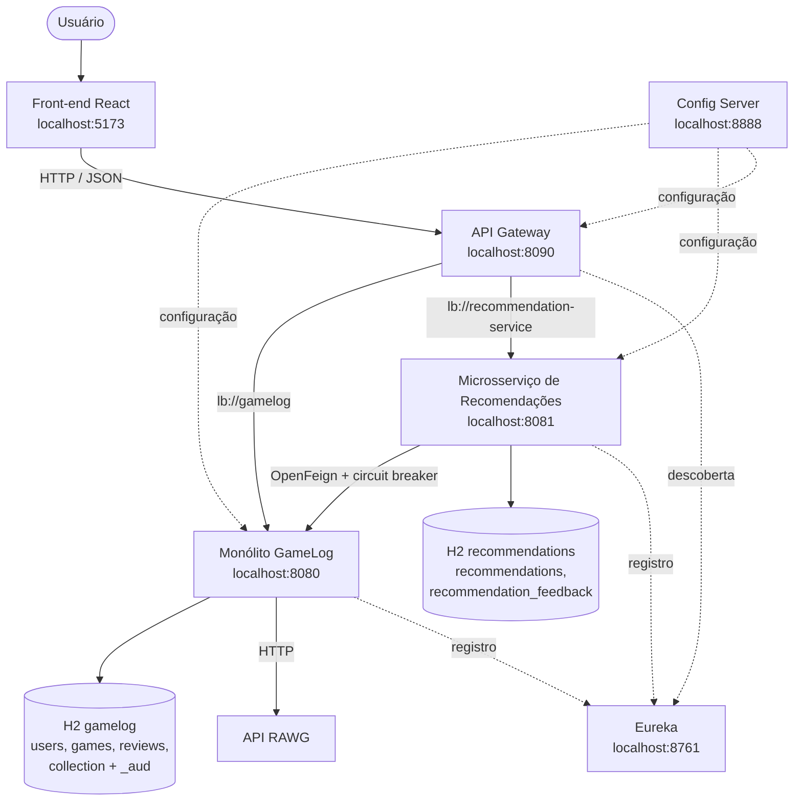
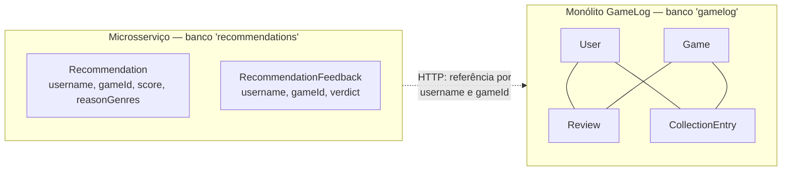

# Microsserviço de Recomendações

Documentação arquitetural da **Terceira Entrega**: a criação de um microsserviço
em Spring Boot, integrado ao GameLog com Spring Cloud.

Até o TP2 o GameLog era um monólito modular: um processo, um banco. Agora o
sistema tem **dois serviços de negócio**, cada um com o seu banco, conversando por
HTTP — e três componentes de infraestrutura que tornam essa conversa possível.

---

## 1. O que o microsserviço faz

Dado um usuário, ele recomenda jogos do catálogo que essa pessoa ainda não
conhece, ordenados pela afinidade com os gêneros que ela costuma gostar, e guarda
o retorno dela (*gostei* / *não me interessa*) para melhorar as próximas rodadas.

### Por que este subdomínio, e não outro

A entrega pede um microsserviço integrado ao sistema. Havia três caminhos:

| Caminho | Por que não foi escolhido |
|---|---|
| Extrair o módulo `catalog` para fora do monólito | É refatoração, não serviço novo. Mexeria em `review`, `collection` e nos 21 testes que já existiam, com risco alto e nenhum conceito novo no domínio. |
| Serviço de estatísticas / ranking | Seria só leitura agregada: nenhum dado próprio, nada que justificasse banco separado. Na prática, um cache do monólito. |
| **Recomendações** ✅ | Subdomínio novo e legítimo; tem **dado exclusivo** (o feedback); precisa **ler dados de outro serviço**, o que exige comunicação distribuída de verdade; e rende uma interface onde dá para *ver* o algoritmo funcionando. |

O ponto decisivo é o dado exclusivo. "Gostei desta recomendação" é um conceito que
o monólito não tem e nunca vai ter. Se a tabela de feedback sumir, a informação se
perde — não há de onde reconstruir. Isso é o que separa um microsserviço com banco
próprio de um processo a mais lendo o banco de outro.

---

## 2. Topologia



| Processo | Porta | Papel |
|---|---|---|
| `config-server` | 8888 | Configuração centralizada (Spring Cloud Config, perfil `native`) |
| `discovery-server` | 8761 | Registro e descoberta (Eureka) |
| `api-gateway` | 8090 | Porta única de entrada; roteia por caminho de URL |
| `gamelog` | 8080 | O monólito modular do TP1/TP2 + o módulo `integration` novo |
| `recommendation-service` | 8081 | **O microsserviço desta entrega** |
| `frontend` | 5173 | React + Vite |

### Uma decisão que atravessa tudo: degradação graciosa

Todo serviço importa configuração com `optional:configserver:` e tolera o Eureka
ausente. A razão é concreta: `cd services/gamelog && mvn spring-boot:run` precisa continuar
funcionando exatamente como o README sempre documentou. A stack distribuída é um
**acréscimo**, não um pré-requisito — e isso também evita a armadilha clássica em
que a ordem de inicialização derruba tudo em cascata.

---

## 3. Modelo de domínio atualizado

O sistema passou a ter **dois contextos delimitados que não compartilham
persistência**.



Dentro do monólito, `Review` e `CollectionEntry` referenciam `User` e `Game` com
`@ManyToOne` — chave estrangeira, integridade garantida pelo banco. No
microsserviço **não existe `@ManyToOne` nenhum**: `username` é `String` e `gameId`
é `Long`, sem FK.

Isso não é descuido, é a fronteira do serviço. Uma chave estrangeira exigiria que
as duas tabelas morassem no mesmo banco — e aí não haveria dois serviços, e sim uma
aplicação com dois processos e um banco compartilhado, que é o pior dos dois
mundos.

**O que se paga:** o banco não pode garantir que aquele `gameId` existe.
**O que se ganha:** o microsserviço continua respondendo quando o monólito cai, e
cada lado evolui o próprio esquema sem avisar o outro.

### As duas entidades novas

**`recommendations`** — uma recomendação gerada

| Coluna | Tipo | Observação |
|---|---|---|
| `id` | Long | identity |
| `username` | String | identidade no outro serviço, indexado |
| `game_id` | Long | identidade no outro serviço |
| `game_title` | String | **duplicado** do catálogo (ver abaixo) |
| `game_cover_url` | String(1000) | duplicado do catálogo |
| `score` | double | pontuação do algoritmo, 0 a 5 |
| `reason_genres` | String(500) | `"Aventura,RPG de Acao"`; vazio = veio da nota da comunidade |
| `generated_at` | Instant | quando o lote foi calculado |

Constraint única `(username, game_id)`; índice em `username`.

Título e capa são duplicados **de propósito**. Sem eles, montar a tela exigiria uma
segunda chamada ao monólito para descobrir o nome de cada jogo — e, pior, o modo
degradado não funcionaria: com o monólito fora do ar a resposta seria uma lista de
ids, inútil para o usuário. Duplicar no momento da geração é o preço normal da
autonomia entre serviços.

**`recommendation_feedback`** — o dado exclusivo

| Coluna | Tipo | Observação |
|---|---|---|
| `id` | Long | identity |
| `username` | String | indexado |
| `game_id` | Long | |
| `verdict` | `LIKED` / `DISMISSED` | `@Enumerated(STRING)`, não ORDINAL |
| `created_at` | Instant | |

Constraint única `(username, game_id)`: um veredito por jogo por pessoa. Guardar o
histórico de opiniões daria ao algoritmo sinais contraditórios sobre o mesmo jogo —
mesmo raciocínio do `CollectionEntry` no monólito, que atualiza em vez de duplicar.

`STRING` e não `ORDINAL` porque gravar `0` e `1` deixaria o banco ilegível e, se
alguém inserisse um valor novo no meio do enum, os dados antigos passariam a
significar outra coisa.

### Repositórios dedicados

```java
public interface RecommendationRepository extends JpaRepository<Recommendation, Long> {
    List<Recommendation> findByUsernameOrderByScoreDesc(String username);
    boolean existsByUsername(String username);

    @Modifying(flushAutomatically = true, clearAutomatically = true)
    @Query("delete from Recommendation r where r.username = :username")
    void deleteByUsername(@Param("username") String username);
    // ...
}

public interface RecommendationFeedbackRepository
        extends JpaRepository<RecommendationFeedback, Long> {
    List<RecommendationFeedback> findByUsername(String username);
    Optional<RecommendationFeedback> findByUsernameAndGameId(String username, Long gameId);
}
```

> **Um bug que o teste pegou.** `deleteByUsername` começou como método derivado
> (`void deleteByUsername(String)`), que o Spring Data implementa de graça. Ele
> carrega as entidades e as marca como removidas, deixando o DELETE pendente no
> contexto de persistência. Na hora do flush o Hibernate ordena as operações por
> tipo — **INSERT antes de DELETE** — então a recomendação nova de um jogo era
> inserida enquanto a linha antiga do mesmo jogo ainda existia, e a constraint
> `(username, game_id)` estourava. O recálculo simplesmente não funcionava. A
> correção é o delete em massa com `@Modifying`, que executa o SQL na ordem em que
> foi chamado.

---

## 4. Alteração no monólito: o módulo `integration`

O microsserviço precisa de `(gameId, gênero, nota)` para montar afinidade. Os
endpoints que já existiam não serviam: `ReviewResponse` devolve título e capa — o
que a tela precisa — mas **não o gênero**. Sem gênero não há como calcular
afinidade.

Havia duas saídas:

1. O microsserviço faz três chamadas (`/api/games`, perfil, coleção) e cruza as
   listas na memória.
2. O monólito ganha um endpoint feito para esse consumidor.

Escolhemos a **segunda**: são duas chamadas em vez de três, e nenhum DTO existente
muda — então os 21 testes do TP2 seguem válidos. Alterar `ReviewResponse` para
incluir gênero afetaria o front e os testes que já dependem do formato dele; um
consumidor novo com necessidade diferente ganha um endpoint próprio.

```
services/gamelog/src/main/java/com/gamelog/integration/
├── controller/GameActivityController.java
├── service/GameActivityService.java
└── dto/GameActivityResponse.java
```

O módulo existe para deixar explícito no código que o monólito agora tem **dois
tipos de cliente**: o front React e outro serviço. Até o TP2 tinha só um.

### `GET /api/users/{username}/game-activity`

Público (leitura), já coberto pela regra `GET /api/users/**` do `SecurityConfig`.

```json
{
  "username": "demo",
  "ratedGames": [
    { "gameId": 1, "genre": "Aventura",    "rating": 5 },
    { "gameId": 2, "genre": "RPG de Acao", "rating": 4 },
    { "gameId": 3, "genre": "Roguelike",   "rating": 3 }
  ],
  "ownedGameIds": [1, 2, 3]
}
```

Usuário inexistente → **404**. Usuário sem atividade → **200** com listas vazias. A
diferença importa para quem chama: "não existe" é erro de quem pediu; "sem
atividade" é resposta legítima, e o microsserviço a trata recomendando os mais bem
avaliados da comunidade.

### Evitando N+1

`Review.game` e `CollectionEntry.game` são `LAZY`. Percorrer as entidades chamando
`getGame().getGenre()` dispararia uma consulta por review — o mesmo problema N+1
que o TP2 já corrigiu na listagem do catálogo. As duas consultas são projeções
JPQL, uma cada, com o join no banco:

```java
@Query("""
        select new com.gamelog.review.dto.RatedGameRow(r.game.id, r.game.genre, r.rating)
        from Review r
        where r.user.username = :username
        """)
List<RatedGameRow> findRatedGamesByUsername(@Param("username") String username);

@Query("select ce.game.id from CollectionEntry ce where ce.user.username = :username")
List<Long> findOwnedGameIdsByUsername(@Param("username") String username);
```

---

## 5. Endpoints do microsserviço

Todos via gateway (`http://localhost:8090`). O serviço também responde direto na
8081, útil para depurar.

| Método | Rota | Auth | Descrição |
|---|---|---|---|
| GET | `/api/recommendations/{username}` | não | Recomendações vigentes, da maior pontuação para a menor. Gera na hora se for o primeiro acesso. |
| POST | `/api/recommendations/{username}/refresh` | **sim** | Recalcula: busca atividade + catálogo no monólito, pontua e substitui o lote. |
| POST | `/api/recommendations/{username}/feedback` | **sim** | Corpo `{ "gameId": 4, "verdict": "LIKED" }`. Registra ou atualiza o veredito. → 204 |
| GET | `/api/recommendations/{username}/taste-profile` | não | O perfil de gosto calculado: peso por gênero. |
| GET | `/actuator/health` | não | Inclui o estado do disjuntor. |
| POST | `/actuator/refresh` | não | Recarrega a configuração do Config Server. |

### `GET /api/recommendations/{username}`

```json
{
  "username": "demo",
  "generatedAt": "2026-08-14T22:05:31.482Z",
  "stale": false,
  "items": [
    {
      "gameId": 4,
      "gameTitle": "God of War",
      "gameCoverUrl": "https://...",
      "score": 2.5,
      "reasonGenres": ["Aventura", "RPG de Acao"]
    }
  ]
}
```

`stale: true` significa que **esta resposta não refletiu uma conversa
bem-sucedida com o monólito** — o que está aí é o último lote gravado, ou nada.
Expor isso em vez de esconder é uma decisão de honestidade: o front acende um aviso
de modo degradado e o usuário entende por que a lista talvez não tenha mudado.
Fingir normalidade seria pior — ele clicaria em "recalcular" várias vezes sem
entender.

`reasonGenres` traz os **gêneros**, não uma frase pronta. A frase ("porque você
gosta de Aventura e RPG de Ação") é montada no front, porque acentuação, idioma e
tom são assunto da camada de apresentação — o back-end deste projeto escreve
strings sem acento em todo lugar. Lista vazia = a indicação veio da nota da
comunidade.

### `GET /api/recommendations/{username}/taste-profile`

```json
{
  "username": "demo",
  "genres": [
    { "genre": "Aventura",    "weight": 1.0  },
    { "genre": "RPG de Acao", "weight": 0.67 },
    { "genre": "Roguelike",   "weight": 0.33 }
  ]
}
```

### Autenticação: uma limitação assumida

O microsserviço **não tem Spring Security e não valida JWT**. É decisão, não
esquecimento: replicar a validação de token em cada serviço espalharia a chave de
assinatura e a lógica de expiração por todos eles. Como o gateway é o único ponto
de entrada externo, é nele que a barreira faz sentido.

O `AuthenticationFilter` do gateway exige `Authorization: Bearer ...` nos `POST` de
`/api/recommendations/**`. Ele **não** se mete nas escritas do monólito, de
propósito: o monólito valida o próprio token integralmente, e duplicar a regra em
dois lugares criaria duas versões da verdade que podem divergir.

**A limitação:** o gateway confere a *presença* do header, não a *assinatura* do
token. Um token forjado passaria nas rotas de recomendação. Para o escopo desta
entrega é aceitável — o dado protegido é feedback de recomendação — mas não seria
em produção, e por isso está escrito aqui e no código, não escondido.

A evolução natural: o gateway virar um resource server OAuth2
(`spring-security-oauth2-resource-server`) validando a assinatura uma vez para
todos os serviços de trás, ou um Authorization Server dedicado emitindo os tokens
do sistema. Ficou fora do escopo porque exigiria refazer a autenticação do
monólito, que é assunto do TP1 e está funcionando.

### Limitações de segurança da infraestrutura

A stack toda roda em `localhost`, e as peças de infraestrutura estão **sem
autenticação**. Isso é adequado para desenvolvimento e para a demonstração desta
entrega, e seria inaceitável em produção. Listado aqui de propósito: um sistema
distribuído tem superfícies que um monólito não tinha, e reconhecê-las faz parte
de entender a arquitetura.

| Superfície | Risco em produção | O que se faria |
|---|---|---|
| Config Server aberto na 8888 | Qualquer um lê a configuração de qualquer serviço | HTTP Basic ou mTLS, cada cliente com credencial via variável de ambiente, e TLS no transporte |
| Eureka aberto na 8761 | *Service discovery poisoning*: um registro forjado desviaria o tráfego de `lb://gamelog` | Autenticação no `/eureka/**` e rede privada entre os serviços |
| `/actuator/refresh` sem autenticação | Endpoint que **muda estado**, exposto na mesma porta pública | Actuator numa porta de gerenciamento separada, ligada só a `127.0.0.1`, e `ROLE_ACTUATOR` no `/actuator/**` |
| `health.show-details: always` | Expõe detalhes internos (banco, disjuntor) a qualquer um | `when-authorized` depois de proteger o actuator |

Os dois últimos são justamente o que se usa para **demonstrar** a configuração
distribuída e a resiliência (seção 10) — em produção eles continuariam existindo,
só que atrás de autenticação e numa porta interna.

Um ponto que já está resolvido: segredos (`JWT_SECRET`, `RAWG_API_KEY`) **não**
entram no `config-repo`. Eles continuam vindo de variável de ambiente. Config
Server centraliza configuração; cofre de segredo é outro problema, e misturar os
dois é como vazamentos acontecem.

---

## 6. O algoritmo

Estratégia: **content-based por afinidade de gênero**.

Filtragem colaborativa ("usuários parecidos com você gostaram de...") precisa de
massa de dados. Com o volume de um banco de demonstração produziria recomendações
pobres ou vazias. A abordagem por gênero funciona a partir da **primeira**
avaliação e, de bônus, é explicável — dá para dizer ao usuário por que aquele jogo
apareceu.

`TasteProfile` e `RecommendationEngine` são **classes puras**: nada de Spring,
banco ou HTTP. É por isso que 16 testes cobrindo todas as regras rodam em ~120ms.

### Passo 1 — perfil de gosto (`TasteProfile`)

Três sinais, do mais forte ao mais fraco:

| Sinal | Peso |
|---|---|
| Jogo avaliado com nota ≥ `minRating` | `nota − 2.5` |
| Jogo marcado como *gostei* nas recomendações | `likedBoost` |
| Jogo apenas na coleção, sem avaliação | `collectionWeight` |

O `− 2.5` faz nota 5 valer o dobro de nota 4 (2.5 contra 1.5), separando "gostei
muito" de "gostei". Nota abaixo do limiar **não entra**: nota baixa diz que a
pessoa *não* gostou, e tratar isso como afinidade recomendaria mais do mesmo que
ela rejeitou.

No catálogo o gênero vem como string única (`"Action, RPG"`), então é desempacotado
por vírgula e o peso vai para cada gênero.

Ao final, **normaliza** dividindo pelo maior peso: o gênero favorito vale 1.0. Sem
isso, quem avaliou 200 jogos teria pesos na casa das centenas e quem avaliou três
ficaria perto de zero — e como o score soma afinidade com nota da comunidade, a
parte da comunidade viraria irrelevante no primeiro caso e dominante no segundo. O
mesmo algoritmo se comportaria de dois jeitos.

### Passo 2 — candidatos

Jogos do catálogo **menos**: os que o usuário avaliou, os que tem na coleção, e os
que marcou como `DISMISSED`.

Essa é a parte da regra que mais protege a credibilidade da feature. Recomendar um
jogo que a pessoa acabou de avaliar, ou que ela já disse que não quer, faz o
sistema parecer que não presta atenção.

### Passo 3 — pontuação

```
score = afinidade × genreWeight  +  (notaDaComunidade / 5) × communityWeight
```

Com os pesos padrão (3.0 e 2.0) o máximo é 5.0. Dividir a nota por 5 normaliza as
duas componentes para a mesma escala 0..1 antes de aplicar os pesos — senão a nota
da comunidade, que vai de 0 a 5, esmagaria a afinidade, que vai de 0 a 1.

**Afinidade** é a média dos pesos dos gêneros do jogo, contando gênero fora do
perfil como **0** (e não omitindo da média). Um jogo `"Aventura, Sports"` para quem
só gosta de Aventura tem afinidade 0.5, não 1.0 — meio acerto não vale acerto
cheio. Sem essa regra, jogos de gênero único perderiam espaço para jogos que
acertam por acidente.

### Passo 4 — ordenação

Score decrescente, **desempate por `gameId` crescente**. Sem o desempate a ordem
dependeria da ordem de chegada do catálogo: a tela mudaria entre requisições sem
nada ter mudado, e testes de ordem falhariam de forma intermitente.

### Cold start

Perfil vazio (usuário novo, ou que só avaliou jogos mal) → o score cai só na
componente de comunidade e a ordem passa a ser por nota média, com `reasonGenres`
vazio. Devolver lista vazia para quem acabou de se cadastrar seria a pior primeira
impressão possível.

---

## 7. Spring Cloud: o que cada peça resolve

| Componente | Problema concreto que resolve |
|---|---|
| **Config Server** | Com cinco aplicações, o endereço do Eureka apareceria repetido em cinco arquivos. Mais importante: permite mudar configuração de um serviço **que está no ar**. |
| **Eureka** | Sem ele, o microsserviço precisaria de `http://localhost:8080` escrito no código para achar o monólito — funciona na máquina do desenvolvedor e quebra em qualquer outro lugar, além de impedir mais de uma instância. |
| **API Gateway** | O front conheceria dois endereços, e cada serviço novo exigiria mexer nele. Cada serviço também precisaria da sua própria configuração de CORS, e as portas internas ficariam expostas ao navegador. |
| **OpenFeign** | A chamada remota vira uma interface Java. Integrado ao Eureka, `lb://gamelog` vira um endereço real na hora da chamada, com balanceamento. |
| **Resilience4j** | Sem disjuntor, um monólito fora do ar prenderia cada requisição até o timeout: as threads ficam esperando um serviço que já se sabe que não responde, e a falha de um derruba o outro. |

### Configuração distribuída, na prática

Os pesos do algoritmo moram em `config-repo/recommendation-service.yml`:

```yaml
recommendation:
  scoring:
    min-rating: 3
    collection-weight: 0.5
    liked-boost: 1.5
    genre-weight: 3.0
    community-weight: 2.0
    max-results: 8
```

`ScoringProperties` é um `@ConfigurationProperties`, e o Spring Cloud **re-vincula**
esses beans quando chega um `EnvironmentChangeEvent` — ou seja, quando alguém chama
`POST /actuator/refresh`. O `RecommendationService` chama `toWeights()` **a cada
requisição** em vez de guardar os pesos num campo; guardar impediria a nova
configuração de valer.

Isto foi verificado com a stack no ar (seção 10): editar `genre-weight` de `3.0`
para `1.0` e chamar `/actuator/refresh` mudou o score de um jogo de `2.0` para
`0.67`, **sem recompilar e sem reiniciar**.

**Segredos não entram no config-repo.** `JWT_SECRET` e `RAWG_API_KEY` continuam
vindo de variável de ambiente: Config Server centraliza configuração, não é cofre
de segredo.

### Uma armadilha da precedência

`config-repo/application.yml` vale para **todos** os clientes e manda
`register-with-eureka: true`. Configuração do servidor tem prioridade sobre o
`application.yml` local de cada serviço — então o próprio Eureka receberia essa
instrução e tentaria se registrar em si mesmo. A solução é
`config-repo/discovery-server.yml`: o arquivo com o **nome do serviço** vence o
compartilhado. O valor comum quase sempre está certo, e as exceções se resolvem no
arquivo do serviço, não removendo a regra geral.

### Ordem das rotas no gateway

```yaml
routes:
  - id: recommendation-service
    uri: lb://recommendation-service
    order: 0
    predicates:
      - Path=/api/recommendations/**

  - id: gamelog-monolith
    uri: lb://gamelog
    order: 1
    predicates:
      - Path=/api/**
```

`/api/**` casa com `/api/recommendations/**` também. Se a rota genérica fosse
avaliada primeiro, **toda** chamada de recomendação iria para o monólito, que
responderia 404 — e a tela não funcionaria, sem nada na configuração parecer
errado. Os `order` explícitos garantem isso, e um teste o tranca.

As rotas ficam no `application.yml` local do gateway, e **não** no Config Server:
sem elas o gateway sobe sem saber rotear nada e o sistema inteiro fica inacessível.
É dependência demais para pendurar na inicialização. O que ganha de fato com
configuração central são os valores ajustáveis em tempo de execução, não a
topologia.

---

## 8. Resiliência: o caminho degradado

```mermaid
sequenceDiagram
    participant F as Front-end
    participant G as API Gateway
    participant R as Microsserviço
    participant CB as Disjuntor
    participant M as Monólito
    participant DB as H2 recommendations

    F->>G: POST /api/recommendations/demo/refresh
    G->>R: roteia (lb://recommendation-service)
    R->>CB: buscar atividade + catálogo
    CB->>M: GET /api/users/demo/game-activity
    M--xCB: sem resposta (serviço fora do ar)
    Note over CB: conta a falha; passando<br/>de 50% na janela, ABRE
    CB-->>R: Optional.empty() (fallback)
    R->>DB: último lote gravado
    DB-->>R: 8 recomendações
    R-->>G: 200 { stale: true, items: [...] }
    G-->>F: 200
    Note over F: selo "modo degradado"<br/>a tela continua funcionando
```

Configuração (também servida centralmente):

```yaml
resilience4j:
  circuitbreaker:
    instances:
      gamelog:
        sliding-window-size: 5
        minimum-number-of-calls: 3
        failure-rate-threshold: 50
        wait-duration-in-open-state: 10s
        permitted-number-of-calls-in-half-open-state: 2
```

`minimum-number-of-calls: 3` importa: o padrão é 100, o que na prática nunca
abriria numa demonstração.

### O 404 não conta como falha

Usuário sem cadastro no monólito devolve 404. Isso é **resposta válida** dizendo
"esse usuário não tem atividade", não falha de infraestrutura. É tratado antes de
chegar ao disjuntor — se contasse, consultar usuários novos abriria o circuito e
tiraria a feature do ar para todo mundo. Distinguir "o outro serviço está com
problema" de "a resposta dele foi negativa" é o que faz um disjuntor ser útil em
vez de atrapalhar.

### Por que `Optional.empty()` e não exceção

Não conseguir falar com o outro serviço é um cenário **previsto**, com plano B
definido: servir o último lote gravado. Exceção seria tratar isso como imprevisto.
A interface `ActivitySource` expressa exatamente isso — e, por ser interface,
permite testar "monólito fora do ar" com um duplo de dez linhas, sem rede, sem
disjuntor e sem Spring.

---

## 9. Testes

**101 testes**, sendo **80 novos** nesta entrega. Os 21 do TP2 continuam passando
sem alteração.

```bash
mvn test                      # na raiz: todos os módulos Java (86)
cd frontend && npm test       # front-end (15)
```

| Módulo | Testes | O que cobre |
|---|---:|---|
| `gamelog` (monólito) | 30 | 21 do TP2 + 5 das projeções JPQL novas + 4 do endpoint `game-activity` |
| `recommendation-service` | 44 | perfil de gosto, algoritmo, repositórios, serviço, tradução do payload, contrato HTTP |
| `api-gateway` | 8 | roteamento e ordem das rotas, filtro de autenticação, dedupe de CORS |
| `config-server` | 2 | serve de fato as propriedades do `config-repo` |
| `discovery-server` | 2 | o registro responde e não se registra em si mesmo |
| `frontend` | 15 | texto do "porquê", estado do serviço e leitura dos gêneros |

### Escolhas de teste que vale explicar

**Quase nenhum mock de framework.** O teste do endpoint do monólito usa
repositórios reais sobre H2, service real, controller real, Jackson real e o
`GlobalExceptionHandler` real — porque o JSON ali é um **contrato entre
processos**: renomear um campo não quebra compilação em lado nenhum. O teste do
microsserviço substitui só o monólito, por um duplo escrito à mão de dez linhas.
Um mock com expectativas de chamada acabaria afirmando o comportamento do próprio
mock.

**O que os testes NÃO cobrem, e está escrito no código:** o `@CircuitBreaker`
depende do proxy AOP do Spring, então não age num teste unitário. Engolir a exceção
para facilitar o teste seria pior — o disjuntor nunca veria a falha e nunca
abriria. Ele é verificado derrubando o monólito com a stack no ar (seção 10).

**Testes não dependem de infraestrutura.** O `surefire` desliga Config Server e
Eureka: um teste tem de dar o mesmo resultado com ou sem os cinco serviços no ar,
senão o build deixa de ser confiável.

---

## 10. Verificação executada

Tudo abaixo foi observado com os cinco serviços rodando.

**Descoberta.** `/actuator/health` do gateway:
`{"GAMELOG":1,"API-GATEWAY":1,"RECOMMENDATION-SERVICE":1}` — os três registrados.
O Eureka leva ~30s para completar o registro; consultar antes disso mostra a lista
incompleta.

**Configuração distribuída ativa.** `propertySources` do microsserviço:
`configserver:file:../../config-repo/recommendation-service.yml` e
`configserver:file:../../config-repo/application.yml`.

**Perfil de gosto do usuário `demo`** (avaliou Aventura 5, RPG de Ação 4,
Roguelike 3, e tem os três na coleção): Aventura `1.0`, RPG de Ação `0.67`,
Roguelike `0.33` — exatamente o previsto pelo cálculo.

**Ranking:**

| Jogo | Score | Por quê |
|---|---:|---|
| God of War | 2.5 | dois gêneros do perfil (`Aventura`, `RPG de Acao`) |
| Sekiro | 2.0 | `RPG de Acao` |
| The Witcher 3 | 1.5 | `Aventura` (metade dos gêneros casa) |
| Hollow Knight | 1.5 | empate desfeito pelo `gameId` |
| Dead Cells / Slay the Spire | 0.5 | `Roguelike`, o gênero mais fraco |
| Celeste / Stardew Valley | 0.0 | sem afinidade |

9 candidatos, 8 devolvidos — `maxResults` respeitado.

**Gateway e autenticação.** `POST .../refresh` sem token → **401**; com
`Bearer` → **200**. Login pelo gateway (rota do monólito) → token emitido.

**Feedback.** `DISMISSED` no God of War → 204; ele sai da lista e **não volta no
recálculo**. O descarte sobreviveu inclusive a um restart do monólito — ele vive no
banco do microsserviço.

**Configuração em tempo de execução.** `genre-weight` de `3.0` para `1.0` no
`config-repo` + `POST /actuator/refresh` → o `/actuator/refresh` respondeu
`["recommendation.scoring.genre-weight"]` e o score do Sekiro caiu de `2.0` para
`0.67`. Sem recompilar, sem reiniciar.

**Ciclo completo do disjuntor.** Com o monólito derrubado:

| Etapa | Observado |
|---|---|
| 1ª falha | `refresh` → **200** com `stale: true`, 8 itens do banco próprio |
| falhas repetidas | disjuntor **OPEN**, taxa de falha 60% |
| circuito aberto | `notPermittedCalls: 3` — chamadas recusadas **sem tocar a rede** |
| durante tudo isso | as 5 requisições devolveram **HTTP 200**; a API nunca quebrou |
| rota do monólito | `/api/games` → 500, como esperado |
| monólito de volta | disjuntor voltou a **CLOSED** sozinho, `stale: false` |

**CORS.** Preflight `OPTIONS` e `GET` com `Origin: http://localhost:5173`
devolvem exatamente **um** `Access-Control-Allow-Origin` nas duas rotas.

> **Bug que só apareceu aqui.** O monólito configura CORS desde o TP1 e o gateway
> também configura, porque é ele que o navegador vê agora. As rotas do monólito
> saíam com `Access-Control-Allow-Origin` **duplicado** — e o navegador não soma os
> valores, ele **recusa a resposta inteira**. Com `curl` aparecia HTTP 200 e o JSON
> certo, a suíte inteira passava, e o catálogo não carregaria em tela nenhuma. A
> correção é o filtro `DedupeResponseHeader`.

**Front-end.** `vite build` transforma os 1779 módulos sem erro e o dev server
serve os cinco arquivos novos. **Não houve verificação visual em navegador** — este
ambiente não tem Chromium nem Playwright instalados. A API foi verificada de ponta
a ponta, incluindo CORS com `Origin` real, mas o comportamento em tela não foi
observado.

---

## 11. Front-end

O endereço base mudou **uma linha**: de `localhost:8080` para `localhost:8090`.
Foi tudo o que o front precisou saber sobre a arquitetura ter virado distribuída
— o gateway decide, pelo caminho da URL, qual serviço responde.

| Arquivo | Papel |
|---|---|
| `pages/recommendations-page.jsx` | Rota `/recommendations`. Exige login — recomendação é pessoal. |
| `features/recommendations/recommendation-card.jsx` | Capa, pontuação, o "porquê", botões 👍 / ✕ |
| `features/recommendations/taste-profile-chart.jsx` | Barras de peso por gênero — torna a recomendação auditável |
| `features/recommendations/service-status-badge.jsx` | "ao vivo" vs "modo degradado" |
| `features/recommendations/recommendation-text.js` | Funções puras que compõem as frases (testadas) |
| `lib/api/recommendations.js` | As quatro chamadas do microsserviço, isoladas das do monólito |

Tudo o que é específico desta funcionalidade mora em `features/recommendations/`
— inclusive o teste. A estrutura do front espelha a do back: o que pertence a um
contexto fica junto.

`ServiceStatusBadge` é a arquitetura distribuída ficando **visível na tela**: com o
monólito fora do ar, a página continua listando jogos e o selo muda para "modo
degradado".

---

## 12. Como rodar

Um terminal por serviço, nesta ordem:

```bash
cd platform/config-server          && mvn spring-boot:run   # 8888
cd platform/discovery-server       && mvn spring-boot:run   # 8761
cd services/gamelog                         && mvn spring-boot:run   # 8080
cd services/recommendation-service && mvn spring-boot:run   # 8081
cd platform/api-gateway            && mvn spring-boot:run   # 8090

# front-end, em outro terminal
cd frontend && npm run dev
```

Sempre **de dentro da pasta do módulo**: o Config Server procura os `.yml` em
`../../config-repo` e cada serviço com banco cria `./data` relativo ao diretório
atual.

A ordem segue a árvore de dependências (configuração → descoberta → serviços →
gateway). Subir fora de ordem não quebra nada, porque todos usam `optional:` na
configuração e toleram o Eureka ausente; a ordem só mantém o log limpo de
tentativas de reconexão. Espere cada serviço responder antes de subir o próximo —
o Eureka leva cerca de 30 segundos para completar o registro, então o gateway só
consegue rotear depois disso.

| Endereço | O que é |
|---|---|
| http://localhost:5173 | Aplicação |
| http://localhost:8090 | API (gateway) |
| http://localhost:8761 | Painel do Eureka |
| http://localhost:8090/actuator/gateway/routes | Rotas ativas |
| http://localhost:8081/actuator/health | Estado do disjuntor |
| http://localhost:8081/h2-console | Banco do microsserviço (`jdbc:h2:file:./data/recommendations`) |

Usuário de demonstração: **demo / demo123**

> Se o catálogo já existir de uma execução anterior, o seeder não faz nada (é
> idempotente). Para começar do zero, apague `services/gamelog/data/` e
> `services/recommendation-service/data/`.

### Roteiro de demonstração

1. Login como `demo`, abrir **Recomendados**. Mostrar o gráfico de perfil de gosto
   ao lado da lista e o "porquê" em cada card.
2. Descartar um jogo com o ✕. Ele sai da lista; clicar em **Recalcular** e mostrar
   que não volta.
3. Mostrar o painel do Eureka com os três serviços registrados.
4. **Configuração distribuída:** editar `genre-weight` em
   `config-repo/recommendation-service.yml`, chamar
   `POST localhost:8081/actuator/refresh`, recalcular e mostrar as pontuações
   diferentes — sem reiniciar nada.
5. **Resiliência:** derrubar o monólito (`Ctrl+C` na janela dele). Recarregar a
   tela de recomendações: ela continua funcionando, com o selo em "modo degradado".
   Mostrar `localhost:8081/actuator/health` com o disjuntor abrindo. Subir o
   monólito de volta e mostrar o selo voltando a "ao vivo".

---

## 13. Escopo deliberadamente fora

| Fora | Por quê |
|---|---|
| Mensageria (Kafka / RabbitMQ) e comunicação por eventos | Não é pedido pela entrega e adiciona um broker para subir na apresentação. A comunicação síncrona com disjuntor cobre o que a entrega avalia. |
| Docker Compose | Subir cinco serviços com `mvn spring-boot:run` resolve o desenvolvimento local sem exigir Docker instalado. Faria sentido a partir do momento em que houvesse implantação real. |
| Distributed tracing (Zipkin) | Mais um processo, e com dois serviços a cadeia de chamadas ainda é legível pelos logs. |
| PostgreSQL em vez de H2 | A separação de bancos — que é o que a entrega avalia — já está feita com dois arquivos H2 independentes. |
| Authorization Server / OAuth2 no gateway | Exigiria refazer a autenticação do monólito, que é assunto do TP1. A limitação está declarada na seção 5. |
| Extrair `catalog`, `review` ou `collection` para outros serviços | O monólito modular continua sendo a escolha certa para esses subdomínios; quebrar sem necessidade seria complexidade sem retorno. |
