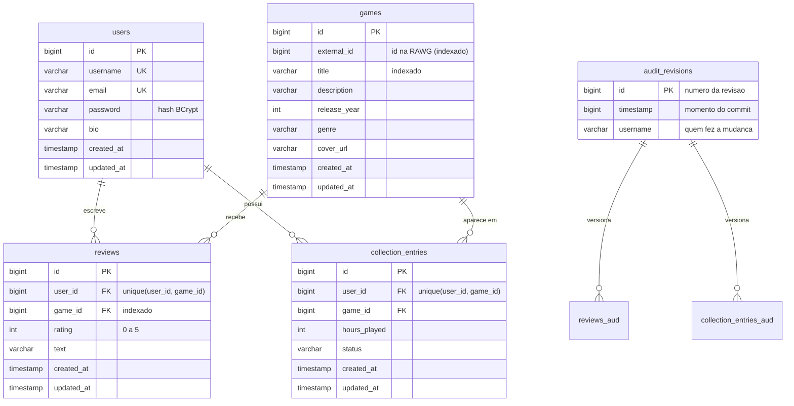

# Camada de Persistência (TP2)

Este documento descreve o design da camada de persistência do GameLog:
o modelo de dados, as decisões de mapeamento JPA, os repositórios Spring Data,
o mecanismo de histórico de mudanças (auditoria) e os testes automatizados.

O TP1 já usava JPA com um H2 **em memória** (os dados sumiam a cada restart).
Nesta etapa a persistência virou "de verdade":

| | TP1 | TP2 |
|---|-----|-----|
| Banco | H2 em memória | H2 **em arquivo** (`services/gamelog/data/`), dados sobrevivem ao restart |
| Datas de criação/alteração | setadas na mão com `Instant.now()` | automáticas (`@CreatedDate` / `@LastModifiedDate`) |
| Histórico de mudanças | não existia | Hibernate Envers + `RevisionRepository` |
| Média de notas do catálogo | calculada em memória, jogo a jogo (N+1) | agregada no banco em 1 consulta (`AVG`/`COUNT` + `GROUP BY`) |
| Busca no catálogo | `findAll` (tudo de uma vez) | busca paginada por título (`Page` + `Pageable`) |
| Índices | só os implícitos das constraints | índices explícitos guiados pelas consultas |
| Testes de persistência | não existiam | 21 testes `@DataJpaTest` |

---

## 1. Modelo de dados



As tabelas `reviews_aud` e `collection_entries_aud` são criadas pelo Envers e
têm as mesmas colunas da tabela original + `rev` (FK pra `audit_revisions`) e
`revtype` (0 = INSERT, 1 = UPDATE, 2 = DELETE).

### Decisões de modelagem

**Isolamento de domínio.** O monólito é modular: `identity`, `catalog`,
`review` e `collection` são módulos separados, cada um dono das suas entidades
e repositórios. `Review` e `CollectionEntry` são as entidades "de ligação"
entre usuário e jogo; os módulos `identity` e `catalog` não sabem que elas
existem. Essa direção única de dependência aparece até no histórico: as
relações auditadas usam `RelationTargetAuditMode.NOT_AUDITED`, ou seja, o
histórico de uma review guarda só o `user_id`/`game_id` sem versionar `User` e
`Game` junto.

**Modelagem guiada pelas consultas.** Cada índice e constraint existe por
causa de uma consulta ou regra concreta:

| Estrutura | Por quê |
|-----------|---------|
| `unique(username)`, `unique(email)` em `users` | Regra de cadastro. A checagem no service evita a corrida comum, mas a constraint é a garantia final (duas requisições simultâneas). De quebra, indexa o `findByUsername` usado em todo login. |
| `unique(user_id, game_id)` em `reviews` e `collection_entries` | Regra de negócio: uma review / um item de coleção por pessoa por jogo. |
| `idx_reviews_game_id` | A página de um jogo lista as reviews dele (`where game_id = ?`). |
| `idx_games_title` | A busca do catálogo filtra por título. |
| `idx_games_external_id` | O import da RAWG confere se o jogo já existe antes de inserir. |

**Relacionamentos LAZY.** Todos os `@ManyToOne` usam `FetchType.LAZY`: o JPA
só carrega o usuário/jogo de uma review quando alguém realmente acessa. Com o
`open-in-view` desligado (ver §5), todo acesso lazy precisa acontecer dentro de
um service `@Transactional`, o que torna o fluxo de dados previsível.

---

## 2. Mapeamento JPA

As entidades usam as anotações padrão do JPA (`@Entity`, `@Table`, `@Id`,
`@GeneratedValue`, `@Column`, `@ManyToOne`, `@JoinColumn`, `@UniqueConstraint`,
`@Index`). O que mudou no TP2:

### Superclasse `Auditable` (datas automáticas)

Todas as entidades estendem uma `@MappedSuperclass` que centraliza as colunas
de auditoria — ela não vira tabela, as colunas aparecem em cada entidade filha:

```java
@MappedSuperclass
@EntityListeners(AuditingEntityListener.class)
public abstract class Auditable {

    @CreatedDate
    @Column(name = "created_at", nullable = false, updatable = false)
    private Instant createdAt;

    @LastModifiedDate
    @Column(name = "updated_at", nullable = false)
    private Instant updatedAt;
}
```

Ninguém mais chama `Instant.now()` na mão: o `AuditingEntityListener` (ligado
por `@EnableJpaAuditing` na classe principal) preenche `created_at` no insert
e `updated_at` em todo update.

### Entidades auditadas (`@Audited`)

`Review` e `CollectionEntry` — os dados que o usuário cria e altera — são
versionadas pelo Envers:

```java
@Entity
@Audited
@AuditOverride(forClass = Auditable.class) // inclui created_at/updated_at no historico
@Table(name = "reviews", ...)
public class Review extends Auditable {

    @ManyToOne(fetch = FetchType.LAZY, optional = false)
    @JoinColumn(name = "user_id")
    @Audited(targetAuditMode = RelationTargetAuditMode.NOT_AUDITED)
    private User user;
    ...
}
```

`User` e `Game` não são auditados de propósito: perfil e catálogo mudam pouco,
e versionar o `User` guardaria hash de senha nas tabelas de auditoria à toa.

---

## 3. Repositórios Spring Data

Cada módulo tem seu repositório. Estender `JpaRepository` já dá o CRUD inteiro
(`save`, `findById`, `findAll`, `delete`...); o resto são consultas derivadas
do nome do método, `@Query` explícita ou o `RevisionRepository` do Envers.

### Consultas derivadas (o Spring Data gera o SQL)

```java
public interface UserRepository extends JpaRepository<User, Long> {
    Optional<User> findByUsername(String username);
    boolean existsByUsername(String username);
    boolean existsByEmail(String email);
}
```

### Busca paginada

```java
public interface GameRepository extends JpaRepository<Game, Long> {
    Page<Game> findByTitleContainingIgnoreCase(String title, Pageable pageable);
    Optional<Game> findByExternalId(Long externalId);
}
```

Uso (no `GameService`):

```java
Page<Game> pagina = gameRepository.findByTitleContainingIgnoreCase(
        "zelda", PageRequest.of(0, 12, Sort.by("title").ascending()));
pagina.getContent();       // so os 12 jogos da pagina
pagina.getTotalElements(); // total de resultados (pro front montar a paginacao)
```

O banco aplica `LIMIT`/`OFFSET`; a aplicação nunca carrega o catálogo inteiro
na memória.

### Agregação no banco (matando o N+1)

O catálogo mostra a média de nota de cada jogo. No TP1 isso era um `SELECT`
de todas as reviews **por jogo**, com a média somada em memória — o clássico
problema N+1. Agora é **uma** consulta pra lista inteira:

```java
@Query("""
        select new com.gamelog.review.dto.GameRatingRow(r.game.id, avg(r.rating), count(r))
        from Review r
        where r.game.id in :gameIds
        group by r.game.id
        """)
List<GameRatingRow> aggregateByGameIds(@Param("gameIds") Collection<Long> gameIds);
```

Uso (no `ReviewService`):

```java
Map<Long, RatingStats> stats = reviewRepository.aggregateByGameIds(gameIds).stream()
        .collect(Collectors.toMap(GameRatingRow::gameId, GameRatingRow::toStats));
```

### Repositório de revisões (histórico)

```java
public interface ReviewRepository
        extends JpaRepository<Review, Long>, RevisionRepository<Review, Long, Long> {
    ...
}
```

`RevisionRepository` vem do `spring-data-envers` e dá, sem nenhuma
implementação manual:

```java
reviewRepository.findRevisions(reviewId);          // linha do tempo completa
reviewRepository.findLastChangeRevision(reviewId); // ultima mudanca
```

Ele é habilitado na classe principal:

```java
@SpringBootApplication
@EnableJpaAuditing
@EnableJpaRepositories(
        basePackages = "com.gamelog",
        repositoryFactoryBeanClass = EnversRevisionRepositoryFactoryBean.class)
public class GameLogApplication { ... }
```

---

## 4. Histórico de mudanças (Hibernate Envers)

### Como funciona

1. `Review` e `CollectionEntry` são `@Audited`.
2. A cada **commit** de transação que toca uma entidade auditada, o Envers
   grava: uma linha em `audit_revisions` (a revisão: número, timestamp e
   usuário) e uma linha na tabela `*_aud` com a foto da entidade.
3. A revisão é customizada pra registrar **quem** fez a mudança:

```java
@Entity
@Table(name = "audit_revisions")
@RevisionEntity(AuditRevisionListener.class)
public class AuditRevision {
    @Id @GeneratedValue @RevisionNumber private Long id;
    @RevisionTimestamp private long timestamp;
    private String username; // preenchido pelo listener
}
```

O `AuditRevisionListener` pega o username do `SecurityContext` (ou seja, do
token JWT da requisição). Mudanças fora de requisição (seeder, testes) ficam
como `"sistema"`.

Com `org.hibernate.envers.store_data_at_delete=true`, até a revisão de
DELETE guarda o último estado — apagar uma review não apaga a trilha dela.

### Consultando o histórico pela API

| Método | Rota | O que devolve |
|--------|------|---------------|
| GET | `/api/reviews/{id}/history` | Linha do tempo da review (só o autor) |
| GET | `/api/collection/{id}/history` | Linha do tempo do item da coleção (só o dono) |

Exemplo real (review criada com nota 5 e depois editada pra 3):

```json
GET /api/reviews/4/history
[
  {
    "revision": 3, "type": "INSERT",
    "modifiedAt": "2026-07-10T22:40:07.31Z", "modifiedBy": "everton_teste",
    "rating": 5, "text": "Primeira impressao: excelente!"
  },
  {
    "revision": 4, "type": "UPDATE",
    "modifiedAt": "2026-07-10T22:40:07.52Z", "modifiedBy": "everton_teste",
    "rating": 3, "text": "Depois de 20 horas, mudei de ideia."
  }
]
```

O caso de uso da coleção é o mais legível: a linha do tempo conta a jornada
com o jogo (`Quero jogar` → `Jogando` → `Zerado`, com as horas de cada fase).

Pra alimentar o histórico, a API de reviews ganhou edição e exclusão:
`PUT /api/reviews/{id}` e `DELETE /api/reviews/{id}` (só o autor).

---

## 5. Integridade e performance

- **Constraints no banco** (unique simples e compostas) como última linha de
  defesa das regras de negócio — os testes provam que elas disparam.
- **Índices** guiados pelas consultas reais (tabela no §1).
- **Transações explícitas**: todo método de service é `@Transactional`
  (leituras com `readOnly = true`, que libera otimizações do Hibernate e do
  pool).
- **`open-in-view` desligado**: a sessão do Hibernate fecha junto com o
  service, não com a resposta HTTP. Conexões voltam mais cedo pro pool e
  nenhum lazy load acidental acontece na camada web.
- **Agregação e paginação no banco** (§3): menos dados trafegando, menos
  memória na aplicação.
- **Banco em arquivo com `ddl-auto=update`**: o Hibernate cria/evolui o schema
  sem nunca apagar dados. (Em produção o próximo passo seria Flyway/Liquibase;
  registrado como limitação consciente.)

---

## 6. Testes automatizados

Rodar: `cd services/gamelog && mvn test` — **21 testes** cobrindo a camada de
persistência, todos com `@DataJpaTest` (sobe só a fatia JPA com um H2 em
memória zerado, sem web e sem seeder).

| Classe | O que prova |
|--------|-------------|
| `UserRepositoryTest` | Consultas derivadas (`findByUsername`, `existsBy...`) e que o banco **rejeita username duplicado** (constraint). |
| `GameRepositoryTest` | Busca por título ignorando maiúsculas, paginação (tamanho da página, total, `hasNext`) e `findByExternalId`. |
| `ReviewRepositoryTest` | Consultas por jogo/usuário, **agregação de média/contagem no banco** e a constraint de uma review por pessoa por jogo. |
| `CollectionRepositoryTest` | Consultas da coleção e atualização sem duplicar item. |
| `AuditableTest` | `created_at`/`updated_at` preenchidos sozinhos; `updated_at` avança no update e `created_at` não muda. |
| `ReviewHistoryTest` | Criar → editar → apagar gera 3 revisões (INSERT/UPDATE/DELETE), cada uma com a foto da época; a revisão guarda **quem** e **quando**. |
| `CollectionHistoryTest` | A linha do tempo do item da coleção (`Quero jogar` → `Jogando` → `Zerado`) fica registrada na ordem certa. |

Detalhe técnico dos testes de histórico: o Envers só grava revisão no commit,
e o `@DataJpaTest` roda cada teste numa transação que é desfeita. Por isso os
testes de histórico desligam a transação do teste
(`@Transactional(propagation = NOT_SUPPORTED)`) e abrem transações reais com
`TransactionTemplate`, uma por operação — igual a produção, onde cada
requisição HTTP é uma transação e vira uma revisão.
